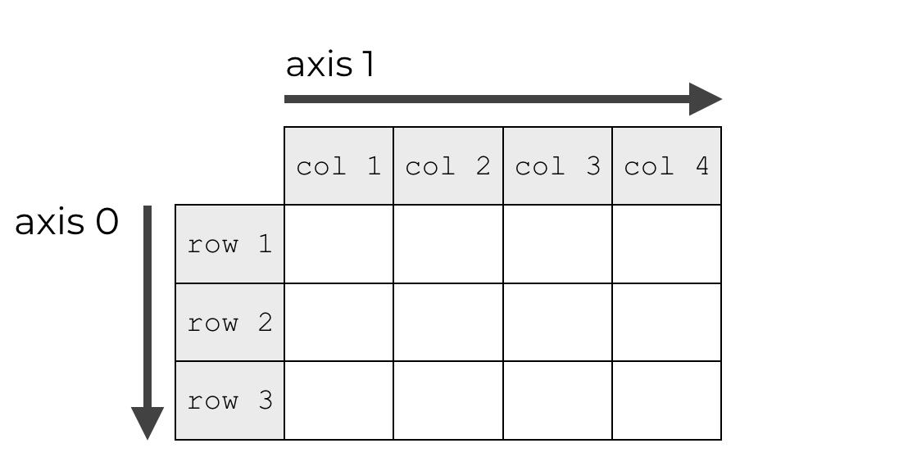
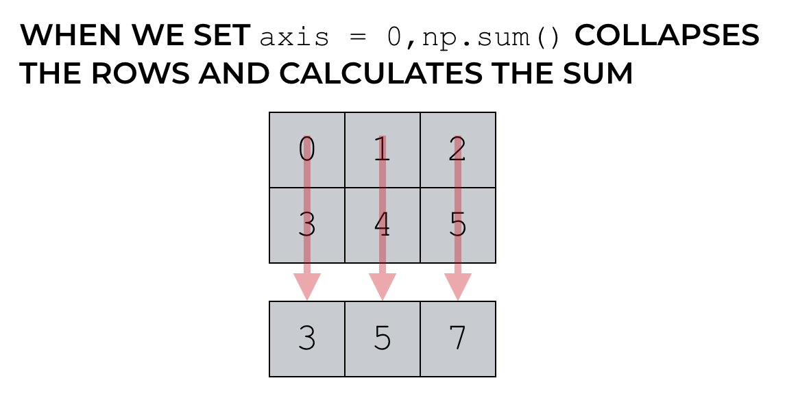
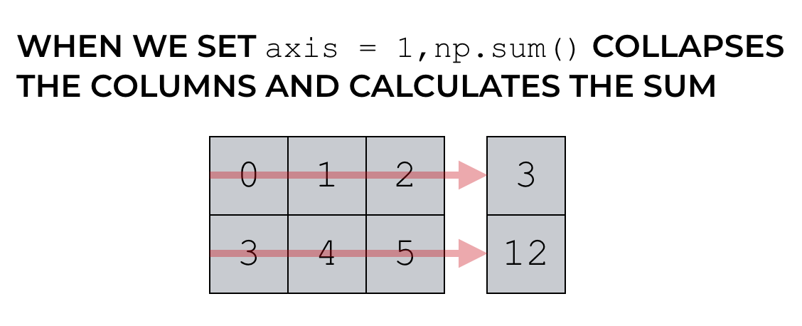

# NumPy and Pandas Note
Numpy 和 Pandas 使用手册，记录基础概念和常用操作。  
[NumPy 官方文档](https://www.numpy.org.cn/user/)  
[Pandas 官方文档](https://www.pypandas.cn/docs/)

# NumPy
NumPy包的核心是 ndarray 对象。它封装了python原生的同数据类型的 n 维数组，采用 c 语言实现后封装。

NumPy数组 和 原生Python Array（数组）之间有几个重要的区别：
+ NumPy 数组在创建时具有固定的大小，更改ndarray的大小将创建一个新数组并删除原来的数组;  
+ NumPy 数组中的元素都需要具有相同的数据类型，因此在内存中的大小相同。   
  (例外情况：Python的原生数组里包含了NumPy的对象的时候。)

## 基础知识
NumPy的主要对象是同构多维数组:  
+ ndarray.ndim  - 数组的轴（axis or rank, 维度）的个数。
+ ndarray.shape - 数组的维度。对于有 n 行和 m 列的矩阵，shape 将是 (n,m)，ndim 将是2。
+ ndarray.size  - 数组元素的总数（等于 shape 的元素的乘积）。
+ ndarray.dtype - 一个描述数组中元素类型的对象。
+ ndarray.itemsize - 数组中每个元素的字节大小（等于 ndarray.dtype.itemsize）。
+ ndarray.data  - 该缓冲区包含数组的实际元素。


### np.array基本属性及创建方式
```python
>>> import numpy as np
>>> a = np.arange(15).reshape(3, 5)
>>> a
array([[ 0,  1,  2,  3,  4],
       [ 5,  6,  7,  8,  9],
       [10, 11, 12, 13, 14]])
>>> a.shape
(3, 5)
>>> a.ndim
2
>>> a.dtype.name
'int64'
>>> a.itemsize
8
>>> a.size
15
>>> type(a)
<type 'numpy.ndarray'>
>>> b = np.array([1, 2, 3])
>>> b
array([1, 2, 3])
>>> b.shape
(3,)
>>> b.reshape(3, 1)
array([[1],
       [2],
       [3]])
>>> c = np.array([(1.2, 2.3), (3.4, 5.6)])
>>> c
array([[1.2, 2.3],
       [3.4, 5.6]])
>>> c.shape
(2, 2)
```

NumPy数组的几种特殊创建方式：zeros创建一个由0组成的数组；函数 ones创建一个完整的数组；  
函数empty 创建一个数组，其初始内容是随机的。  
此外，range函数按步长创建并返回数字类型的数组（而非列表）；linspace函数按元素数量创建数据数组。

```python
>>> np.zeros((3,4))
array([[0., 0., 0., 0.],
       [0., 0., 0., 0.],
       [0., 0., 0., 0.]])
>>> np.ones((2, 3, 4), dtype=np.int16)
array([[[1, 1, 1, 1],
        [1, 1, 1, 1],
        [1, 1, 1, 1]],    
       [[1, 1, 1, 1],
        [1, 1, 1, 1],
        [1, 1, 1, 1]]], dtype=int16)
>>> np.arange(10, 30, 5)
array([10, 15, 20, 25])
>>> np.arange(0, 2, 0.3)
array([0. , 0.3, 0.6, 0.9, 1.2, 1.5, 1.8])
>>> np.linspace(0, 2, 5)
array([0. , 0.5, 1. , 1.5, 2. ])
```

### np.array基本运算
NumPy数组采用 *矢量化* 技术，使数组操作更接近标准的数学符号（通常，更容易正确编码数学结构）。  

数组上的算术运算符会应用到 *元素* 级别.

```python
>>> a = np.array([20,30,40,50])
>>> b = np.arange(4)
>>> b
array([0, 1, 2, 3])
>>> c = a - b
>>> c
array([20, 29, 38, 47])
>>> b**2
array([0, 1, 4, 9], dtype=int32)
>>> np.sin(a)
array([ 0.91294525, -0.98803162,  0.74511316, -0.26237485])
>>> d = np.sin(a)
>>> d
array([ 0.91294525, -0.98803162,  0.74511316, -0.26237485])
>>> 10*d
array([ 9.12945251, -9.88031624,  7.4511316 , -2.62374854])
>>> a<35
array([ True,  True, False, False])
```

乘积运算符*在NumPy数组中按元素进行运算；矩阵乘积可以使用@运算符或dot函数或方法执行。

```python
>>> A = np.array([[1,1],[0,1]])
>>> B = np.array([[2,0],[3,4]])
>>> A * B
array([[2, 0],
       [0, 4]])
>>> A @ B
array([[5, 4],
       [3, 4]])
>>> A.dot(B)
array([[5, 4],
       [3, 4]])
```

某些操作（例如 += 和 *=）会更直接更改被操作的矩阵数组而不会创建新矩阵数组。
当使用不同类型的数组进行操作时，结果数组的类型对应于更一般或更精确的数组。

```python
>>> a = np.ones((2,3),dtype=int)
>>> b = np.random.random((2,3))
>>> a *= 3
>>> a
array([[3, 3, 3],
       [3, 3, 3]])
>>> b += a
>>> b
array([[3.75167227, 3.91048465, 3.76784294],
       [3.14670849, 3.98563566, 3.21821745]])
>>> a += b
Traceback (most recent call last):
  File "<pyshell#25>", line 1, in <module>
    a += b
numpy.core._exceptions.UFuncTypeError: Cannot cast ufunc 'add' output 
from dtype('float64') to dtype('int32') with casting rule 'same_kind'
>>> c = a + b
>>> c
array([[6.75167227, 6.91048465, 6.76784294],
       [6.14670849, 6.98563566, 6.21821745]])
```

许多一元操作，例如计算数组中所有元素的总和，都是作为ndarray类的方法实现的。
默认情况下，这些操作适用于数组，就像它是一个数字列表一样，无论其形状如何。
但是，通过指定axis 参数，您可以沿数组的指定轴应用操作。
<center>
<figure>



</figure>
</center>

```python
>>> a = np.random.random((2, 3))
>>> a
array([[0.02771408, 0.04745953, 0.26362967],
       [0.32621487, 0.34452003, 0.38167734]])
>>> a.sum()
1.3912155213101918
>>> a.min()
0.027714083215368057
>>> a.max()
0.3816773401996695

>>> b = np.arange(12).reshape(3, 4)
>>> b
array([[ 0,  1,  2,  3],
       [ 4,  5,  6,  7],
       [ 8,  9, 10, 11]])
>>> b.sum(axis=0)         #axis指定哪个轴（维度）被折叠，=0表示行折叠
array([12, 15, 18, 21])
>>> b.min(axis=1)         #=1表示列折叠
array([0, 4, 8])
>>> b.cumsum(axis=1)      #沿列累加
array([[ 0,  1,  3,  6],
       [ 4,  9, 15, 22],
       [ 8, 17, 27, 38]], dtype=int32)
```

### 通函数 ufunc
NumPy提供熟悉的数学函数，例如sin，cos和exp。在NumPy中，这些被称为“通函数”（ufunc）。
在NumPy中，这些函数在数组上按元素进行运算，产生一个数组作为输出。

### 索引、切片、迭代
一维的数组可以进行索引、切片和迭代操作的，就像 python 列表一样。
多维的数组每个轴可以有一个索引，这些索引以逗号​​分隔的元组给出。

```python
>>> def f(x,y):
...     return 10*x+y
...
>>> b = np.fromfunction(f,(5,4),dtype=int)
>>> b
array([[ 0,  1,  2,  3],
       [10, 11, 12, 13],
       [20, 21, 22, 23],
       [30, 31, 32, 33],
       [40, 41, 42, 43]])

>>> b[2,3]                          # 索引
23
>>> b[0:5, 1]                       # each row in the second column of b
array([ 1, 11, 21, 31, 41])
>>> b[ : ,1]                        # equivalent to the previous example
array([ 1, 11, 21, 31, 41])
>>> b[1:3, : ]                      # each column in the second and third row of b
array([[10, 11, 12, 13],
       [20, 21, 22, 23]])
>>> b[-1]                           # the last row. Equivalent to b[-1,:]
array([40, 41, 42, 43])

>>> for row in b:                   # 对多维数组进行 迭代, 是相对于第一个轴完成的
...     print(row)
...
[0 1 2 3]
[10 11 12 13]
[20 21 22 23]
[30 31 32 33]
[40 41 42 43]
>>> for element in b.flat:          # 使用flat属性，对数组中的每个元素执行操作
...     print(element)
...
0
1
2
3
10
11
12
13
20
21
22
23
30
31
32
33
40
41
42
43

```

# Pandas


