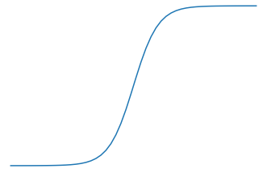
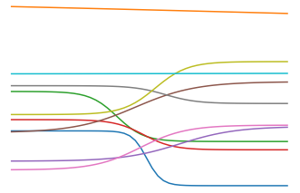
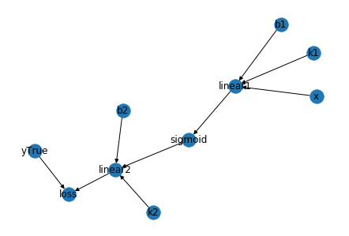

# 深度学习基础介绍

介绍关于深度学习的基本概念。

---------------------------------------------------------------------------------

## 通过历史数据来预测未曾见到过的数据

### 通过数据统计来预测结果

**K Nearest Neighbors**

```python
def knn(query_x, history, top_n=3):
    sorted_notes = sorted(history.items(), key=lambda xy: (xy[0] - query_x)**2)
    similary_notes = sorted_notes[:top_n]
    similary_ys = [y for _, y in similary_notes]
    return np.mean(similary_ys)
```

---------------------------------------------------------------------------------

### 通过拟合函数来更快地预测结果

**Random Approach**

$$f(x) = k*x + b$$

therefore:

$$\begin{aligned}
loss(y, \hat{y}) &= \frac{1}{N} {\sum_{i \in N}(y_i - \hat{y_i})^2}   \\
loss(y, \hat{y}) &= \frac{1}{N} {\sum_{i \in N}(k*x_i + b - \hat{y_i})^2}  \\
\end{aligned}$$ 

```python
def loss(y_hats, y):
    return np.mean((y_hats - y)**2)

def ra_linear(query_x, history, val_range, steps, min_loss) -> tuple:
    for step in range(steps):
        k, b = random.randrange(-val_range, val_range), random.randrange(-val_range, val_range)
        y_hats = [k*x + b for x in query_x]
        curr_loss = loss(y_hats, history)

        if curr_loss < min_loss:
            return (k, b)

def predicate(x, k, b):
    return k*x + b    
```

---------------------------------------------------------------------------------

### 通过监督的方法来更快地更新函数权值

**Monte Carlo Approach**

$$Loss(k, b) = \frac{1}{N} {\sum_{i \in N}(k*x_i + b - \hat{y_i})^2}$$

supervise:

$$\begin{aligned}   
\frac{\partial{Loss(k, b)}}{\partial{k}} &= \frac{2}{N} {\sum_{i \in N}(k*x_i+b - \hat{y_i})*x_i} \\
\frac{\partial{Loss(k, b)}}{\partial{b}} &= \frac{2}{N} {\sum_{i \in N}(k*x_i+b - \hat{y_i})}  \\
\end{aligned}$$   

therefore:

$$\begin{aligned}  
k_{n+1} &= k_{n} + (-1)*\frac{\partial{Loss(k, b)}}{\partial{k}}*\mathrm{d}k \\
b_{n+1} &= b_{n} + (-1)*\frac{\partial{Loss(k, b)}}{\partial{b}}*\mathrm{d}b \\
\end{aligned}$$


```python
def loss(y_hats, y):
    return np.mean((y_hats - y)**2)

def partial_k(k, b, x, y):
    return 2*np.mean((k*x + b - y)*x)

def partial_b(k, b, x, y):
    return 2*np.mean(k*x + b - y)

def mc_linear(query_x, history, learn_rate, steps, min_loss) -> tuple:
    k, b = random.random(), random.random()
    for step in range(steps):
        k = k + partial_k(k, b, query_x, history)*(-1)*learn_rate
        b = b + partial_b(k, b, query_x, history)*(-1)*learn_rate
        y_hats = [k*x + b for x in query_x] 
        curr_loss = loss(y_hats, y)

        if curr_loss < min_loss:
            return (k, b)

def predicate(x, k, b):
    return k*x + b 
```

---------------------------------------------------------------------------------

### 非线性函数的拟合

1. 使用基本的、简单的 **元函数** 就可以拟合非常多的复杂的函数；
2. 组合线性函数和非线性函数就可以拟合各种曲线。  

$$sigmoid(x) = \frac{1}{1+e^{x}}$$

其中，非线性函数常用**sigmoid 函数**，又称为 **激活函数**，来拟合非线性关系。 


```python
def sigmoid(x):
    return 1 / (1 + np.exp(-x))

def random_linear(x):
    k, b = random.normalvariate(0, 1), random.normalvariate(0, 1)
    return k*x + b

# 非线性函数sigmoid。
sub_x = np.linspace(-10, 10)
plt.plot(sub_x, sigmoid(sub_x))

# 通过一个线性函数random_linear和一个非线性函数sigmoid拟合各种曲线。
for i in range(10):
    plt.plot(sub_x, random_linear(sigmoid(random_linear(sub_x))))       
```

<div align="center">


</div>


---------------------------------------------------------------------------------

##  神经网络

**链式求导（前馈网络，Feed Forwad Net）**  

$$\begin{aligned}
linear_1 &= k_1*x + b_1 \\
linear_2 &= k_2*sigmoid(linear_1) + b_2
\end{aligned}$$

$$ \Rightarrow \quad Loss(k_1, k_2, b_1, b_2) = \frac{1}{N} {\sum_{i \in N}(linear_2 - \hat{y_i})^2} $$

therefore:

$$\begin{gathered}
\frac{\partial{Loss}}{\partial{k_1}} = \frac{\partial{Loss}}{\partial{linear_2}} *\frac{\partial{linear_2}}{\partial{sigmoid}} *\frac{\partial{sigmoid}}{\partial{linear_1}} *\frac{\partial{linear_1}}{\partial{k_1}} \\
\\
\frac{\partial{Loss}}{\partial{b_1}} = \frac{\partial{Loss}}{\partial{linear_2}} *\frac{\partial{linear_2}}{\partial{sigmoid}} *\frac{\partial{sigmoid}}{\partial{linear_1}} *\frac{\partial{linear_1}}{\partial{b_1}} \\
\\
\frac{\partial{Loss}}{\partial{k_2}}、\frac{\partial{Loss}}{\partial{b_2}} ...\\
\end{gathered}$$

**梯度下降（反馈网络，Feed Back Net）**

$$\begin{gathered}
k_{1_{n+1}} = k_{1_{n}} + (-1)*\frac{\partial{Loss}}{\partial{k_1}}*\mathrm{d}k  \\
b_{1_{n+1}} = b_{1_{n}} + (-1)*\frac{\partial{Loss}}{\partial{b_1}}*\mathrm{d}b  \\
k_{2_{n+1}}、b_{2_{n+1}} ...
\end{gathered}$$

一般，深度神经网络都超过 3 层变换。可以将以上计算链路展开为树状图展示。

```python
# 节点。
class Node():
    def __init__(self, name, inputs=[]):
        self.name = name
        self.inputs = inputs
        self.outputs = []
        for node in self.inputs:
            node.outputs.append(self)

    def forward(self):
        print("Get self value: {}".format(self.name))

    def backward(self):
        pass
    
    def __repr__(self):
        return self.name

# 空位。
class PlaceHolder(Node):
    def __init__(self, name):
        Node.__init__(self, name)

    def forward(self):
        print("::=>Get myself value by humam being.")

    def backward(self):
        print("I get my gradient from computer memory directly.")

# 计算。
class Operator(Node):
    def __init__(self, name, inputs=[]):
        Node.__init__(self, name=name, inputs=inputs)

    def forward(self):
        print("::=>Get myself value by calculating inputs:{}".format(self.inputs))

    def backward(self):
        print("Get gradient ∂loss/∂{} and save to memory".format(self.inputs))

        if self.outputs:
            for n in self.inputs:
                print("==:> ∂loss/∂{} = ∂loss/∂{}*∂{}/∂{}".format(n, self.name, self.name, n))
        else:
            print("I am the final node.")
```

定义计算图。

```python
node_x       = PlaceHolder("x")
node_k1      = PlaceHolder("k1")
node_b1      = PlaceHolder("b1")
node_linear1 = Operator("linear1", inputs=[node_k1, node_b1, node_x])
node_sigmoid = Operator("sigmoid", inputs=[node_linear1])
node_k2      = PlaceHolder("k2")
node_b2      = PlaceHolder("b2")
node_linear2 = Operator("linear2", inputs=[node_k2, node_b2, node_sigmoid])
node_y_true  = PlaceHolder("yTrue")
node_loss    = Operator("loss", inputs=[node_linear2, node_y_true])

computing_graph = {
    node_k1:      [node_linear1],
    node_b1:      [node_linear1],
    node_x :      [node_linear1],
    node_linear1: [node_sigmoid],
    node_sigmoid: [node_linear2],
    node_k2:      [node_linear2],
    node_b2:      [node_linear2],
    node_linear2: [node_loss],
    node_y_true : [node_loss],
    }
```
<div align="center">

</div>

生成链式计算顺序。

```python
# 方法一： 手动指定。
order = [
    node_x, node_k1, node_b1, 
    node_linear1, 
    node_sigmoid, 
    node_k2, node_b2, 
    node_linear2, node_y_true, 
    node_loss
    ]

# 方法二： 自动生成。
def topologic(input_graph) -> list:
    order, graph = [], input_graph
    while graph:
        all_nodes_have_output = set(graph.keys())
        all_nodes_have_input  = set(reduce(add, graph.values()))

        nodes_have_output_no_input = all_nodes_have_output - all_nodes_have_input
        if nodes_have_output_no_input:
            n = random.choice(list(nodes_have_output_no_input))
            print("Get node: ", n)  
            order.append(n)          
            if len(graph) == 1:
                order += graph[n]
            graph.pop(n)
            for _, links in graph.items():
                if n in links: links.remove(n)
        else:
            raise TypeError("This graph can't get topologic order, which has circle")
    return order
```

执行链式计算。

```python
# 前馈网络，计算损失。
for node in order:
    print("I am: {}".format(node))
    node.forward()

# 后馈网络，根据梯度更新节点值。
for node in order[::-1]:
    print("I am: {}".format(node))
    node.backward()

# 更新节点值。
for node in order:
    if isinstance(node, PlaceHolder):
        print("Update node: {}.value = {}.value + (-1)*∂loss/∂{}".format(node, node, node))
```

---------------------------------------------------------------------------------


