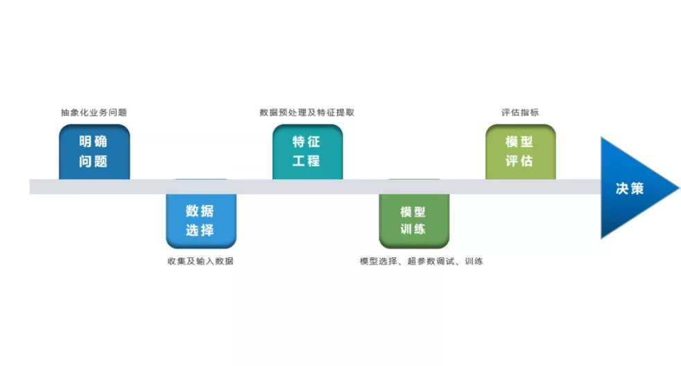
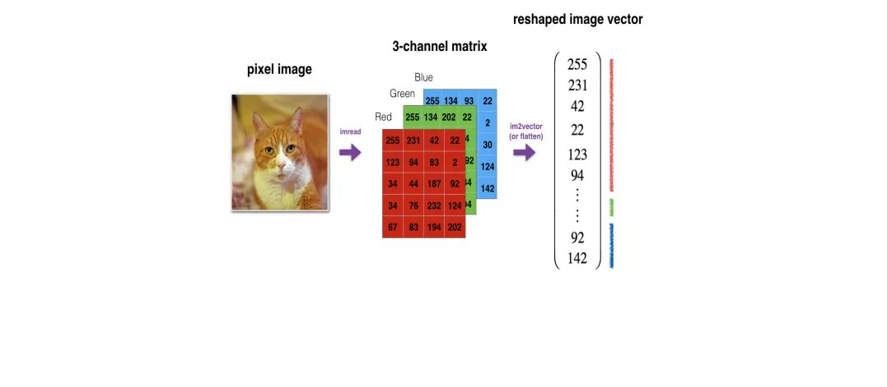
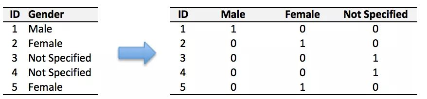
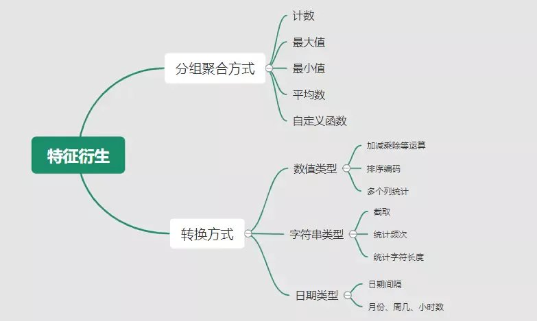
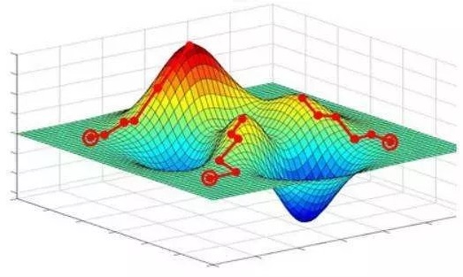
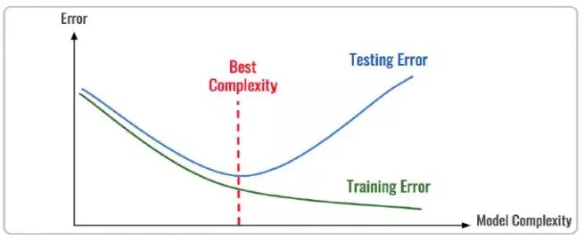
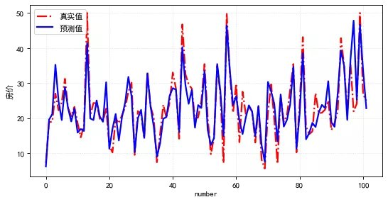

# Keras学习指南

[keras 中文文档](https://keras.io/zh/) 

[keras入门](#keras入门)   
[预测波士顿房价的keras深度神经网络模型](#预测波士顿房价的keras深度神经网络模型)  


 

------

# keras入门

Keras 的核心数据结构是 model，一种组织网络层的方式。最简单的模型是 Sequential 顺序模型，  
它由多个网络层线性堆叠。对于更复杂的结构，你应该使用 Keras 函数式 API，  
它允许构建任意的神经网络图。

Keras 的核心原则是使事情变得相当简单，  
同时又允许用户在需要的时候能够进行完全的控制（终极的控制是源代码的易扩展性）。

[Sequential顺序模型](#Sequential顺序模型)  
[模型训练和评估](#模型训练和评估)   
[模型存储和加载](#模型存储和加载)  
[模型加速](#模型加速)   
[模型迁移](#模型迁移)


[top](#Keras学习指南)

```python
'''使用 Sequential 顺序模型
'''
from keras.models import Sequential

model = Sequential()


'''使用 .add() 堆叠模型
'''
from keras.layers import Dense

model.add(Dense(units=64, activation='relu', input_dim=100))
model.add(Dense(units=10, activation='softmax'))


'''使用 .compile() 配置学习过程
'''
model.compile(loss='categorical_crossentropy',
              optimizer='sgd',
              metrics=['accuracy'])


'''批量地在训练数据上进行迭代
'''
# x_train 和 y_train 是 Numpy 数组。
model.fit(x_train, y_train, epochs=5, batch_size=32)


'''评估模型性能
'''
loss_and_metrics = model.evaluate(x_test, y_test, batch_size=128)


'''对新的数据生成预测
'''
classes = model.predict(x_test, batch_size=128)

```

------

## Sequential顺序模型

Tutorial from [sequential_model](https://keras.io/guides/sequential_model/): 

A Sequential model is appropriate for a plain stack of layers where each layer has  
exactly one input tensor and one output tensor.

```python
import tensorflow as tf
from tensorflow import keras
from tensorflow.keras import layers
```

### Creating a Sequential model

```python
#---------------------------------------------------------------
# style 1
#---------------------------------------------------------------

# Define Sequential model with 3 layers.
# To create a Sequential model by passing a list of layers to the Sequential constructor.
model = keras.Sequential(
    [
        layers.Dense(2, activation="relu", name="layer1"), # with layer name and activation function.
        layers.Dense(3, activation="relu", name="layer2"),
        layers.Dense(4, name="layer3"),
    ]
)

# Call model on a test input.
x = tf.ones((3, 3)) # specified input shape.
y = model(x)

#---------------------------------------------------------------
# style 2
#---------------------------------------------------------------

# Create 3 layers.
layer1 = layers.Dense(2, activation="relu", name="layer1")
layer2 = layers.Dense(3, activation="relu", name="layer2")
layer3 = layers.Dense(4, name="layer3")

# Call layers on a test input.
x = tf.ones((3, 3))
y = layer3(layer2(layer1(x)))

#---------------------------------------------------------------
# style 3
#---------------------------------------------------------------

model = keras.Sequential(name="my_sequential") # accept name too.

# To create a Sequential model incrementally via the add() method.
model.add(layers.Dense(2, activation="relu"))
model.add(layers.Dense(3, activation="relu"))
model.add(layers.Dense(4))

# Call model on a test input.
x = tf.ones((3, 3)) # specified input shape.
y = model(x)

```

------

### Specifying the input shape in advance

Generally, all layers in Keras need to know the shape of their inputs in order to be able   
to create their `weights`, or it has no weights.

When you instantiate a Sequential model without an input shape, it isn't "built":   
it has no weights. The weights are created when the model first sees some input data.

Once a model is "built", you can call its `summary()` method to display its contents.

```python
#---------------------------------------------------------------
# case 1: create a layer without an input shape
#---------------------------------------------------------------

layer = layers.Dense(3)
layer.weights  # Empty

# Call layer on a test input.
x = tf.ones((1, 4))
y = layer(x)
layer.weights  # Now it has weights, of shape (4, 3) and (3,)

#---------------------------------------------------------------
# case 1: create a Sequential model without an input shape
#---------------------------------------------------------------

model = keras.Sequential(
    [
        layers.Dense(2, activation="relu"),
        layers.Dense(3, activation="relu"),
        layers.Dense(4),
    ]
)  # No weights at this stage!

# At this point, you can't do this:
# model.weights

# You also can't do this:
# model.summary()

# Call the model on a test input.
x = tf.ones((1, 4))
y = model(x)
print("Number of weights after calling the model:", len(model.weights))  # 6

# call `.summary()` to display its contents.
model.summary()

```

However, it can be very useful when building a Sequential model incrementally to  
be able to display the summary of the model so far, including the current output shape.   
In this case, you should start your model by passing an `Input` object to your model,  
so that it knows its input shape from the start.

A simple alternative is to just pass an `input_shape` argument to your first layer.  
Models built with a predefined input shape like this always have weights (even before seeing any data)   
and always have a defined output shape.

In general, it's a recommended best practice to always specify the input shape of   
a Sequential model in advance if you know what it is.

```python
#---------------------------------------------------------------
# case 1: create a Sequential model with given an input shape
#---------------------------------------------------------------
model = keras.Sequential()
model.add(keras.Input(shape=(4,)))
model.add(layers.Dense(2, activation="relu"))

model.summary()

#---------------------------------------------------------------
# case 2: create a Sequential model with given shape layer
#---------------------------------------------------------------

model = keras.Sequential()
model.add(layers.Dense(2, activation="relu", input_shape=(4,))) # first layer with shape.

model.summary()

```

------

### A common debugging workflow: `add()` + `summary()`

When building a new Sequential architecture, it's useful to incrementally stack layers   
with `add()` and frequently print model summaries. 

For instance, this enables you to monitor how a stack of `Conv2D` and `MaxPooling2D` layers is   
downsampling image feature maps:

```python
model = keras.Sequential()
model.add(keras.Input(shape=(250, 250, 3)))  # 250x250 RGB images
model.add(layers.Conv2D(32, 5, strides=2, activation="relu")) # convolution layer
model.add(layers.Conv2D(32, 3, activation="relu"))
model.add(layers.MaxPooling2D(3)) # pooling layer

# Can you guess what the current output shape is at this point? Probably not.
# Let's just print it:
model.summary()

# The answer was: (40, 40, 32), so we can keep downsampling...

model.add(layers.Conv2D(32, 3, activation="relu"))
model.add(layers.Conv2D(32, 3, activation="relu"))
model.add(layers.MaxPooling2D(3))
model.add(layers.Conv2D(32, 3, activation="relu"))
model.add(layers.Conv2D(32, 3, activation="relu"))
model.add(layers.MaxPooling2D(2))

# And now?
model.summary()

# Now that we have 4x4 feature maps, time to apply global max pooling.
model.add(layers.GlobalMaxPooling2D())

# Finally, we add a classification layer.
model.add(layers.Dense(10))

```

------

### Feature extraction with a Sequential model

Once a Sequential model has been built, it behaves like a Functional API model.   
This means that every layer has an input and output attribute.   
These attributes can be used to do neat things, like quickly creating a model   
that extracts the outputs of all intermediate layers in a Sequential model.

```python
initial_model = keras.Sequential(
    [
        keras.Input(shape=(250, 250, 3)),
        layers.Conv2D(32, 5, strides=2, activation="relu", name="layer1"),
        layers.Conv2D(32, 3, activation="relu", name="layer2"),
        layers.Conv2D(32, 3, activation="relu", name="layer3"),
    ]
)

# extract features from all layers.
feature_extractor_all = keras.Model(
    inputs=initial_model.inputs,
    outputs=[layer.output for layer in initial_model.layers],
)

# extract features from one layer.
feature_extractor_layer2 = keras.Model(
    inputs=initial_model.inputs,
    outputs=initial_model.get_layer(name="layer2").output,
)

# Call feature extractor on test input.
x = tf.ones((1, 250, 250, 3))
features1 = feature_extractor_all(x)
features2 = feature_extractor_layer2(x)
```

------

### Transfer learning with a Sequential model

Transfer learning consists of freezing the bottom layers in a model and only training the top layers.  

Here are two common transfer learning blueprint involving Sequential models.

First, let's say that you have a Sequential model, and you want to freeze all layers except the last one.   
In this case, you would simply iterate over `model.layers` and set `layer.trainable = False` on each layer,  
except the last one.

```python
model = keras.Sequential([
    keras.Input(shape=(784)),
    layers.Dense(32, activation='relu'),
    layers.Dense(32, activation='relu'),
    layers.Dense(32, activation='relu'),
    layers.Dense(10),
])

# Presumably you would want to first load pre-trained weights.
model.load_weights(...)

# Freeze all layers except the last one.
for layer in model.layers[:-1]:
  layer.trainable = False

# Recompile and train (this will only update the weights of the last layer).
model.compile(...)
model.fit(...)

```

Another common blueprint is to use a Sequential model to stack a pre-trained model and  
some freshly initialized classification layers.

```python
# Load a convolutional base with pre-trained weights
base_model = keras.applications.Xception(
    weights='imagenet',
    include_top=False,
    pooling='avg')

# Freeze the base model
base_model.trainable = False

# Use a Sequential model to add a trainable classifier on top
model = keras.Sequential([
    base_model,
    layers.Dense(1000),
])

# Compile & train
model.compile(...)
model.fit(...)

```

------

## 模型训练和评估

[keras模型训练和评估](https://keras.io/guides/training_with_built_in_methods/)  


## 模型存储和加载

[keras模型存储和加载](https://keras.io/guides/serialization_and_saving/)

------

## 模型加速

[keras模型加速](https://keras.io/guides/distributed_training/)

------

## 模型迁移 

[keras模型迁移](https://keras.io/guides/transfer_learning/)


[back](#keras入门)

------

# 预测波士顿房价的keras深度神经网络模型

[深度学习建模预测全流程（Python）](https://mp.weixin.qq.com/s/hbyRhGpPvBHdUAARmw2K8g?from=singlemessage&scene=1&subscene=10000&clicktime=1638229745&enterid=1638229745) 

机器学习一般可以概括为：从数据出发，选择某种模型，通过优化算法更新模型的参数值，  
使任务的指标表现变好（学习目标），  
最终学习到“好”的模型，并运用模型对数据做预测以完成任务。由此可见，  
机器学习方法有四个要素：数据、模型、学习目标、优化算法。

[明确问题及数据选择](#明确问题及数据选择)  
[特征工程](#特征工程)  
[模型训练](#模型训练)  
[模型评估及优化](#模型评估及优化)   
[模型预测结果及解释性](#模型预测结果及解释性)

[top](#Keras学习指南)

 

------

## 明确问题及数据选择

1. 明确问题

深度学习的建模预测，首先需要明确问题，即抽象为机器/深度学习的预测问题：  
需要学习什么样的数据作为输入，  
目标是得到什么样的模型做决策作为输出。

2. 数据选择

深度学习是端对端学习，学习过程中会提取到高层次抽象的特征，大大弱化特征工程的依赖，正因为如此，  
数据选择也显得格外重要，其决定了模型效果的上限。  
如果数据质量差，预测的结果自然也是很差的——业界一句名言“garbage in garbage out”。  
数据选择是准备机器/深度学习原料的关键，需要关注的是：  
    + 数据样本规模：对于深度学习等复杂模型，通常样本量越多越好。  
当样本数据量较少以及样本不均衡情况，深度学习常用到数据增强的方法。

    + 数据的代表性：数据质量差、无代表性，会导致模型拟合效果差。  
需要明确与任务相关的数据表范围，避免缺失代表性数据或引入大量无关数据作为噪音。

    + 数据时间范围：对于监督学习的特征变量x及标签y，如与时间先后有关，则需要划定好数据时间窗口，  
否则可能会导致常见的数据泄漏问题，即存在了特征与标签因果颠倒的情况。

------

## 特征工程

特征工程就是对原始数据分析处理，转化为模型可用的特征。这些特征可以更好地向预测模型描述潜在规律，  
提高模型对未见数据的准确性。对于深度学习模型，特征生成等加工不多，主要是一些数据的分析、预处理，  
然后就可以灌入神经网络模型了。

1. 探索性数据分析

选择好数据后，可以先做探索性数据分析（EDA）去理解数据本身的内部结构及规律。  
对数据情况不了解，也没有业务背景知识，不做相关的分析及预处理，直接将数据喂给模型往往效果不太好。  
通过探索性数据分析，可以了解数据分布、缺失、异常及相关性等情况。

可以通过 EDA 数据分析库如 pandas_profiling，自动生成分析报告。

2. 特征表示

图像、文本字符等数据，需要转换为计算机能够处理的数值形式。图像数据（pixel image）实际上是由一个像素组成的矩阵所构成的，  
而每一个像素点又是由RGB颜色通道中分别代表R、G、B的一个三维向量表示，  
所以图像实际上可以用RGB三维矩阵（3-channel matrix）的表示（第一个维度：高度，第二个维度：宽度，第三个维度：RGB通道），  
最终再重塑为一列向量（reshaped image vector）方便输入模型。



文本类（类别型）的数据可以用多维数组表示，包括：
+ ONEHOT（独热编码）表示：用单独一个位置的0或1来表示每个变量值，将每个不同的字符取值用唯一的多维数组来表示，将文字转化为数值。


+ word2vetor分布式表示：通过神经网络模型学习每个单词与邻近词的关系，从而将单词表示成低维稠密向量。  
通过这样的分布式表示可以学习到单词的语义信息，直观来看语义相似的单词其对应的向量距离相近。

3. 特征清洗

+ 异常值处理：收集的数据由于人为或者自然因素可能引入了异常值（噪音），这会对模型学习进行干扰。  
通常需要处理人为引起的异常值，通过业务及技术手段(如数据分布、3σ准则)判定异常值，再结合实际业务含义删除或者替换掉异常值。

+ 缺失值处理：神经网络模型缺失值的处理是必要的，数据缺失值可以通过结合业务进行填充数值或者删除。  
若缺失率较高，结合业务可以直接删除该特征变量，或新增一个bool类型的变量特征记录该字段的缺失情况，缺失记为1，非缺失记为0。  
若缺失率较低，可使用一些缺失值填充手段，如结合业务fillna为0或-9999或平均值，或者训练回归模型预测缺失值并填充。

4. 特征生成

特征生成作用在于弥补基础特征对样本信息的表达有限，增加特征的非线性表达能力，提升模型效果。  
它是根据基础特征的含义进行某种处理（聚合/转换之类），常用方法如人工设计、自动化特征衍生（如featuretools工具）。



深度神经网络会自动学习到高层次特征，常见的深度学习的任务，图像类、文本类任务通常很少再做特征生成。  
而对于数值类的任务，加工出显著特征对加速模型的学习是有帮助的，可以做尝试。

5. 特征选择

特征选择用于筛选出显著特征、摒弃非显著特征。这样做主要可以减少特征（避免维度灾难），提高训练速度，降低运算开销；  
减少干扰噪声，降低过拟合风险，提升模型效果。常用的特征选择方法有：  
+ 过滤法（如特征缺失率、单值率、相关系数）、
+ 包装法（如RFE递归特征消除、双向搜索）、
+ 嵌入法（如带L1正则项的模型、树模型自带特征选择）。

------

## 模型训练

神经网络模型的训练主要有3个步骤：
+ 构建模型结构（主要有神经网络结构设计、激活函数的选择、模型权重如何初始化、网络层是否批标准化、正则化策略的设定）；
+ 模型编译（主要有学习目标、优化算法的设定）；
+ 模型训练及超参数调试（主要有划分数据集，超参数调节及训练）；

1. 模型结构

常见的神经网络模型结构有全连接神经网络(FCN)、RNN（常用于文本 / 时间系列任务）、CNN（常用于图像任务）等等。
神经网络由输入层、隐藏层与输出层构成。不同的层数、神经元（计算单元）数目的模型性能也会有差异：  
+ 输入层：为数据特征输入层，输入数据特征维数就对应着网络的神经元数。（注：输入层不计入模型层数）

+ 隐藏层：即网络的中间层（可以很多层），其作用接受前一层网络输出作为当前的输入值，并计算输出当前结果到下一层。  
隐藏层的层数及神经元个数直接影响模型的拟合能力。

+ 输出层：为最终结果输出的网络层。输出层的神经元个数代表了分类类别的个数（注：在做二分类时情况特殊一点，  
如果输出层的激活函数采用sigmoid，输出层的神经元个数为1个；  
如果采用softmax，输出层神经元个数为2个是与分类类别个数对应的；）

对于模型结构的神经元个数，输入层、输出层的神经元个数通常是确定的，主要需要考虑的是隐藏层的深度及宽度，  
在忽略网络退化问题的前提下，通常隐藏层的神经元的越多，模型有更多的容量（capcity）去达到更好的拟合效果（也更容易过拟合）。  
搜索合适的网络深度及宽度，常用有人工经验调参、随机 / 网格搜索、贝叶斯优化等方法。经验上的做法，  
可以参照下同类任务效果良好的神经网络模型的结构，结合实际的任务，再做些微调。

2. 激活函数

根据万能近似原理，神经网络有“够深的网络层”以及“至少一层带激活函数的隐藏层”，既可以拟合任意的函数。  
可见激活函数的重要性，它起着特征空间的非线性转换。对于激活函数选择的经验性做法：
+ 对于输出层，二分类的输出层的激活函数常选择sigmoid函数，多分类选择softmax；  
回归任务根据输出值范围来确定使不使用激活函数。
+ 对于隐藏层的激活函数通常会选择使用ReLU函数，保证学习效率。

3. 权重初始化

权重参数初始化可以加速模型收敛速度，影响模型结果。常用的初始化方法有：
+ uniform均匀分布初始化；
+ normal高斯分布初始化。

需要注意的是，权重不能初始化为0，这会导致多个隐藏神经元的作用等同于1个神经元，无法收敛。

4. 批标准化

batch normalization（BN）批标准化，是神经网络模型常用的一种优化方法。 

batch normalization在保留输入信息的同时，消除了层与层间的分布差异，具有加快收敛，  
同时有类似引入噪声正则化的效果。  
它可应用于网络的输入层或隐藏层，当用于输入层，就是线性模型常用的特征标准化处理。

5. 正则化

正则化是在以（可能）增加经验损失为代价，以降低泛化误差为目的，抑制过拟合，提高模型泛化能力的方法。  
经验上，对于复杂任务，深度学习模型偏好带有正则化的较复杂模型，以达到较好的学习效果。正则化策略有：  
dropout，L1、L2、earlystop方法。

6. 选择学习目标

机器/深度学习通过学习到“好”的模型去决策，“好”即是机器/深度学习的学习目标，  
通常也就是预测值与目标值之间的误差尽可能的低。  
衡量这种误差的函数称为代价函数 （Cost Function）或者损失函数（Loss Function），更具体地说，  
机器/深度学习的目标是极大化降低损失函数。

对于不同的任务，往往也需要用不同损失函数衡量，经典的损失函数包括：  
+ 回归任务的均方误差损失函数。  
衡量模型回归预测的误差情况，一个简单思路是用各个样本i的预测值f(x;w)减去实际值y求平方后的平均值，  
这也就是经典的均方误差（Mean Squared Error）损失函数。  
通过极小化降低均方误差损失函数，可以使得模型预测值与实际值数值差异尽量小。

+ 二分类任务的交叉熵损失函数。  
衡量二分类预测模型的误差情况，常用交叉熵损失函数，  
使得模型预测分布尽可能与实际数据经验分布一致（最大似然估计）。

7. 选择优化算法

当我们机器/深度学习的学习目标是极大化降低（某个）损失函数，那么如何实现这个目标呢？

通常机器学习模型的损失函数较复杂，很难直接求损失函数最小的公式解。幸运的是，  
我们可以通过优化算法（如梯度下降、随机梯度下降、Adam等）有限次迭代优化模型参数，  
以尽可能降低损失函数的值，得到较优的参数值。



对于大多数任务而言，通常可以直接先试下Adam、SGD，然后可以继续在具体任务上验证不同优化器效果。

8. 模型训练及超参数调试

**划分数据集**

训练模型前，常用的HoldOut验证法（此外还有留一法、k折交叉验证等方法），把数据集分为训练集和测试集，  
并可再对训练集进一步细分为训练集和验证集，以方便评估模型的性能。
+ 训练集（training set）：用于运行学习算法，训练模型。
+ 开发验证集（development set）用于调整模型超参数、EarlyStopping、选择特征等，以选择出合适模型。
+ 测试集（test set）只用于评估已选择模型的性能，但不会据此改变学习算法或参数。

**超参数调试**

神经网络模型的超参数是比较多的：
+ 数据方面超参数: 如验证集比例、batch size等；
+ 模型方面超参数：如单层神经元数、网络深度、选择激活函数类型、dropout率等；
+ 学习目标方面超参数：如选择损失函数类型，正则项惩罚系数等；
+ 优化算法方面超参数：如选择梯度算法类型、初始学习率等。

常用的超参调试有人工经验调节、网格搜索（grid search或for循环实现）、随机搜索（random search）、  
贝叶斯优化（bayesian optimization）等方法。

另外，有像[Keras Tuner](https://keras.io/keras_tuner/)分布式超参数调试框架，集成了常用调参方法。

------

## 模型评估及优化

机器学习学习的目标是极大化降低损失函数，但这不仅仅是学习过程中对训练数据有良好的预测能力（极低的训练损失），  
根本上还在于要对新数据（测试集）能有很好的预测能力（泛化能力）。

1. 评估模型误差的指标

评估模型的预测误差常用损失函数的大小来判断，如回归预测的均方损失。  
但除此之外，对于一些任务，用损失函数作为评估指标并不直观，所以像分类任务的评估还常用f1-score，  
可以直接展现各种类别正确分类情况。

2. 评估拟合效果

评估模型拟合（学习）效果，常用欠拟合、拟合良好、过拟合来表述，拟合良好的模型具有更好泛化能力，  
在未知数据（测试集）有更好的效果。

可以通过训练误差及验证集误差评估模型的拟合程度。从整体训练过程来看，欠拟合时训练误差和验证集误差均较高，  
随着训练时间及模型复杂度的增加而下降。在到达一个拟合最优的临界点之后，训练误差下降，验证集误差上升，  
这个时候模型就进入了过拟合区域。



3. 优化拟合效果的方法

实践中通常欠拟合不是问题，可以通过使用强特征及较复杂的模型提高学习的准确度。而解决过拟合，即如何减少泛化误差，  
提高泛化能力，通常才是优化模型效果的重点。  
常用的方法在于提高数据的质量、数量以及采用适当的正则化策略。

------

## 模型预测结果及解释性

决策应用是机器学习最终目的，对模型预测信息加以分析解释，并应用于实际的工作领域。

对于实际工作需要注意的是，工程上是结果导向，模型在线上运行的效果直接决定模型的成败，不仅仅包括其准确程度、误差等情况，  
还包括其运行的速度（时间复杂度）、资源消耗程度（空间复杂度）、稳定性的综合考虑。

1. 模型预测

评估测试集的预测结果，如 mse 损失，观察测试集的实际值与预测值两者的数值曲线的匹配程度。



2. 模型解释

对于神经网络模型预测的分析解释，我们有时需要知道学习的内容，决策的过程是怎么样的（模型的可解释性）。
一个可以解释的AI模型（Explainable AI, 简称XAI）意味着运作的透明，便于人类对于对AI决策的监督及接纳，  
以保证算法的公平性、安全性及隐私性，从而创造更加安全可靠的应用。

在具体任务中，希望能够获得样本每个特征与其结果之间的关系，特别是针对模型误分的那些样本，  
如果能够从特征和结果的角度进行分析，对于提高模型效果或是分析异常样本，是非常有帮助的。  
此外，针对某些特定的场景，如风控等，我们甚至可以分析拒绝样本的具体原因，提供给运营部门，完善业务流程。

深度学习可解释性常用方法有：LIME、LRP、SHAP（SHapley Additive exPlanations，事后归因分析）等方法。

[back](#预测波士顿房价的keras深度神经网络模型)

------


