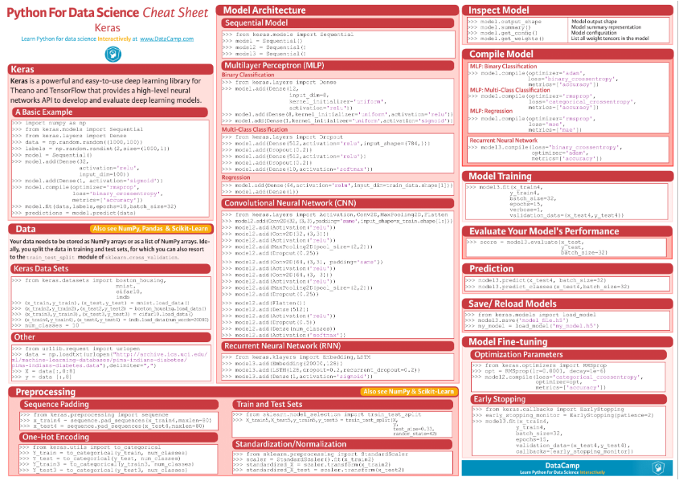

# Keras Tutorial

Keras 学习指南。

[keras 中文文档](https://keras.io/zh/) 

 

------

# 预测波士顿房价的keras深度神经网络模型

[深度学习建模预测全流程（Python）](https://mp.weixin.qq.com/s/hbyRhGpPvBHdUAARmw2K8g?from=singlemessage&scene=1&subscene=10000&clicktime=1638229745&enterid=1638229745) 

机器学习一般可以概括为：从数据出发，选择某种模型，通过优化算法更新模型的参数值，使任务的指标表现变好（学习目标），  
最终学习到“好”的模型，并运用模型对数据做预测以完成任务。由此可见，  
机器学习方法有四个要素：数据、模型、学习目标、优化算法。

[明确问题及数据选择](#明确问题及数据选择)  
[特征工程](#特征工程)  
[模型训练](#模型训练)  
[模型评估及优化](#模型评估及优化)  

 

------

## 明确问题及数据选择

1. 明确问题

深度学习的建模预测，首先需要明确问题，即抽象为机器/深度学习的预测问题：  
需要学习什么样的数据作为输入，  
目标是得到什么样的模型做决策作为输出。

2. 数据选择

深度学习是端对端学习，学习过程中会提取到高层次抽象的特征，大大弱化特征工程的依赖，正因为如此，  
数据选择也显得格外重要，其决定了模型效果的上限。  
如果数据质量差，预测的结果自然也是很差的——业界一句名言“garbage in garbage out”。  
数据选择是准备机器/深度学习原料的关键，需要关注的是：  
    + 数据样本规模：对于深度学习等复杂模型，通常样本量越多越好。  
当样本数据量较少以及样本不均衡情况，深度学习常用到数据增强的方法。

    + 数据的代表性：数据质量差、无代表性，会导致模型拟合效果差。  
需要明确与任务相关的数据表范围，避免缺失代表性数据或引入大量无关数据作为噪音。

    + 数据时间范围：对于监督学习的特征变量x及标签y，如与时间先后有关，则需要划定好数据时间窗口，  
否则可能会导致常见的数据泄漏问题，即存在了特征与标签因果颠倒的情况。

------

## 特征工程

特征工程就是对原始数据分析处理，转化为模型可用的特征。这些特征可以更好地向预测模型描述潜在规律，  
提高模型对未见数据的准确性。对于深度学习模型，特征生成等加工不多，主要是一些数据的分析、预处理，  
然后就可以灌入神经网络模型了。

1. 探索性数据分析

选择好数据后，可以先做探索性数据分析（EDA）去理解数据本身的内部结构及规律。  
对数据情况不了解，也没有业务背景知识，不做相关的分析及预处理，直接将数据喂给模型往往效果不太好。  
通过探索性数据分析，可以了解数据分布、缺失、异常及相关性等情况。

可以通过 EDA 数据分析库如 pandas_profiling，自动生成分析报告。

2. 特征表示

图像、文本字符等数据，需要转换为计算机能够处理的数值形式。图像数据（pixel image）实际上是由一个像素组成的矩阵所构成的，  
而每一个像素点又是由RGB颜色通道中分别代表R、G、B的一个三维向量表示，  
所以图像实际上可以用RGB三维矩阵（3-channel matrix）的表示（第一个维度：高度，第二个维度：宽度，第三个维度：RGB通道），  
最终再重塑为一列向量（reshaped image vector）方便输入模型。

文本类（类别型）的数据可以用多维数组表示，包括：
+ ONEHOT（独热编码）表示：用单独一个位置的0或1来表示每个变量值，将每个不同的字符取值用唯一的多维数组来表示，将文字转化为数值。

+ word2vetor分布式表示：通过神经网络模型学习每个单词与邻近词的关系，从而将单词表示成低维稠密向量。  
通过这样的分布式表示可以学习到单词的语义信息，直观来看语义相似的单词其对应的向量距离相近。

3. 特征清洗

+ 异常值处理：收集的数据由于人为或者自然因素可能引入了异常值（噪音），这会对模型学习进行干扰。  
通常需要处理人为引起的异常值，通过业务及技术手段(如数据分布、3σ准则)判定异常值，再结合实际业务含义删除或者替换掉异常值。

+ 缺失值处理：神经网络模型缺失值的处理是必要的，数据缺失值可以通过结合业务进行填充数值或者删除。  
若缺失率较高，结合业务可以直接删除该特征变量，或新增一个bool类型的变量特征记录该字段的缺失情况，缺失记为1，非缺失记为0。  
若缺失率较低，可使用一些缺失值填充手段，如结合业务fillna为0或-9999或平均值，或者训练回归模型预测缺失值并填充。

4. 特征生成

特征生成作用在于弥补基础特征对样本信息的表达有限，增加特征的非线性表达能力，提升模型效果。  
它是根据基础特征的含义进行某种处理（聚合/转换之类），常用方法如人工设计、自动化特征衍生（如featuretools工具）。

深度神经网络会自动学习到高层次特征，常见的深度学习的任务，图像类、文本类任务通常很少再做特征生成。  
而对于数值类的任务，加工出显著特征对加速模型的学习是有帮助的，可以做尝试。

5. 特征选择

特征选择用于筛选出显著特征、摒弃非显著特征。这样做主要可以减少特征（避免维度灾难），提高训练速度，降低运算开销；  
减少干扰噪声，降低过拟合风险，提升模型效果。常用的特征选择方法有：  
+ 过滤法（如特征缺失率、单值率、相关系数）、
+ 包装法（如RFE递归特征消除、双向搜索）、
+ 嵌入法（如带L1正则项的模型、树模型自带特征选择）。

------

## 模型训练

神经网络模型的训练主要有3个步骤：
+ 构建模型结构（主要有神经网络结构设计、激活函数的选择、模型权重如何初始化、网络层是否批标准化、正则化策略的设定）；
+ 模型编译（主要有学习目标、优化算法的设定）；
+ 模型训练及超参数调试（主要有划分数据集，超参数调节及训练）；

1. 模型结构

常见的神经网络模型结构有全连接神经网络(FCN)、RNN（常用于文本 / 时间系列任务）、CNN（常用于图像任务）等等。
神经网络由输入层、隐藏层与输出层构成。不同的层数、神经元（计算单元）数目的模型性能也会有差异：  
+ 输入层：为数据特征输入层，输入数据特征维数就对应着网络的神经元数。（注：输入层不计入模型层数）

+ 隐藏层：即网络的中间层（可以很多层），其作用接受前一层网络输出作为当前的输入值，并计算输出当前结果到下一层。  
隐藏层的层数及神经元个数直接影响模型的拟合能力。

+ 输出层：为最终结果输出的网络层。输出层的神经元个数代表了分类类别的个数（注：在做二分类时情况特殊一点，  
如果输出层的激活函数采用sigmoid，输出层的神经元个数为1个；  
如果采用softmax，输出层神经元个数为2个是与分类类别个数对应的；）

对于模型结构的神经元个数，输入层、输出层的神经元个数通常是确定的，主要需要考虑的是隐藏层的深度及宽度，  
在忽略网络退化问题的前提下，通常隐藏层的神经元的越多，模型有更多的容量（capcity）去达到更好的拟合效果（也更容易过拟合）。  
搜索合适的网络深度及宽度，常用有人工经验调参、随机 / 网格搜索、贝叶斯优化等方法。经验上的做法，  
可以参照下同类任务效果良好的神经网络模型的结构，结合实际的任务，再做些微调。

2. 激活函数

根据万能近似原理，神经网络有“够深的网络层”以及“至少一层带激活函数的隐藏层”，既可以拟合任意的函数。  
可见激活函数的重要性，它起着特征空间的非线性转换。对于激活函数选择的经验性做法：
+ 对于输出层，二分类的输出层的激活函数常选择sigmoid函数，多分类选择softmax；  
回归任务根据输出值范围来确定使不使用激活函数。
+ 对于隐藏层的激活函数通常会选择使用ReLU函数，保证学习效率。

3. 权重初始化

权重参数初始化可以加速模型收敛速度，影响模型结果。常用的初始化方法有：
+ uniform均匀分布初始化；
+ normal高斯分布初始化。

需要注意的是，权重不能初始化为0，这会导致多个隐藏神经元的作用等同于1个神经元，无法收敛。

4. 批标准化

batch normalization（BN）批标准化，是神经网络模型常用的一种优化方法。 

batch normalization在保留输入信息的同时，消除了层与层间的分布差异，具有加快收敛，  
同时有类似引入噪声正则化的效果。  
它可应用于网络的输入层或隐藏层，当用于输入层，就是线性模型常用的特征标准化处理。

5. 正则化

正则化是在以（可能）增加经验损失为代价，以降低泛化误差为目的，抑制过拟合，提高模型泛化能力的方法。  
经验上，对于复杂任务，深度学习模型偏好带有正则化的较复杂模型，以达到较好的学习效果。正则化策略有：  
dropout，L1、L2、earlystop方法。

6. 选择学习目标

机器/深度学习通过学习到“好”的模型去决策，“好”即是机器/深度学习的学习目标，  
通常也就是预测值与目标值之间的误差尽可能的低。  
衡量这种误差的函数称为代价函数 （Cost Function）或者损失函数（Loss Function），更具体地说，  
机器/深度学习的目标是极大化降低损失函数。

对于不同的任务，往往也需要用不同损失函数衡量，经典的损失函数包括：  
+ 回归任务的均方误差损失函数。  
衡量模型回归预测的误差情况，一个简单思路是用各个样本i的预测值f(x;w)减去实际值y求平方后的平均值，  
这也就是经典的均方误差（Mean Squared Error）损失函数。  
通过极小化降低均方误差损失函数，可以使得模型预测值与实际值数值差异尽量小。

+ 二分类任务的交叉熵损失函数。  
衡量二分类预测模型的误差情况，常用交叉熵损失函数，  
使得模型预测分布尽可能与实际数据经验分布一致（最大似然估计）。

7. 选择优化算法

当我们机器/深度学习的学习目标是极大化降低（某个）损失函数，那么如何实现这个目标呢？

通常机器学习模型的损失函数较复杂，很难直接求损失函数最小的公式解。幸运的是，  
我们可以通过优化算法（如梯度下降、随机梯度下降、Adam等）有限次迭代优化模型参数，  
以尽可能降低损失函数的值，得到较优的参数值。

对于大多数任务而言，通常可以直接先试下Adam、SGD，然后可以继续在具体任务上验证不同优化器效果。

8. 模型训练及超参数调试

**划分数据集**

训练模型前，常用的HoldOut验证法（此外还有留一法、k折交叉验证等方法），把数据集分为训练集和测试集，  
并可再对训练集进一步细分为训练集和验证集，以方便评估模型的性能。
+ 训练集（training set）：用于运行学习算法，训练模型。
+ 开发验证集（development set）用于调整模型超参数、EarlyStopping、选择特征等，以选择出合适模型。
+ 测试集（test set）只用于评估已选择模型的性能，但不会据此改变学习算法或参数。

**超参数调试**

神经网络模型的超参数是比较多的：
+ 数据方面超参数: 如验证集比例、batch size等；
+ 模型方面超参数：如单层神经元数、网络深度、选择激活函数类型、dropout率等；
+ 学习目标方面超参数：如选择损失函数类型，正则项惩罚系数等；
+ 优化算法方面超参数：如选择梯度算法类型、初始学习率等。

常用的超参调试有人工经验调节、网格搜索（grid search或for循环实现）、随机搜索（random search）、  
贝叶斯优化（bayesian optimization）等方法。

另外，有像[Keras Tuner](https://keras.io/keras_tuner/)分布式超参数调试框架，集成了常用调参方法。

------

## 模型评估及优化

[back](#预测波士顿房价的keras深度神经网络模型)

------

