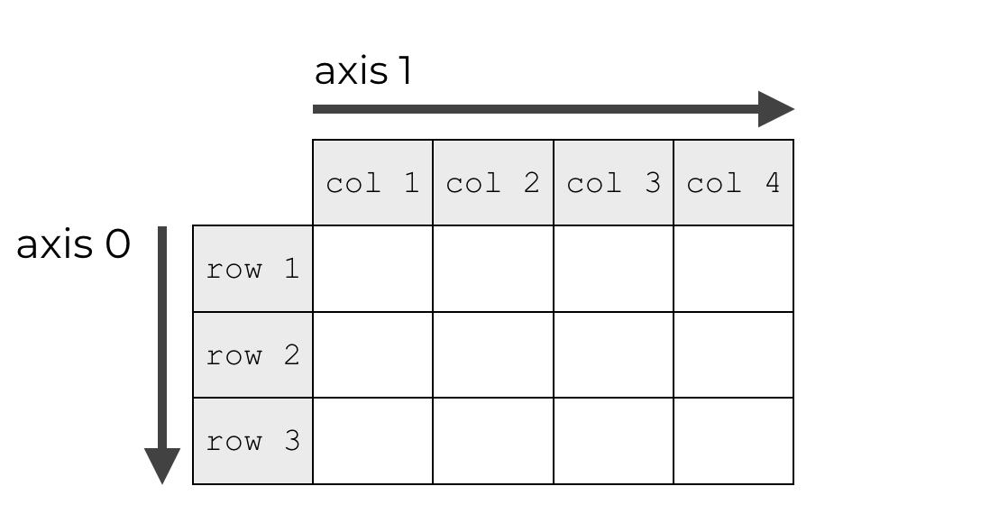
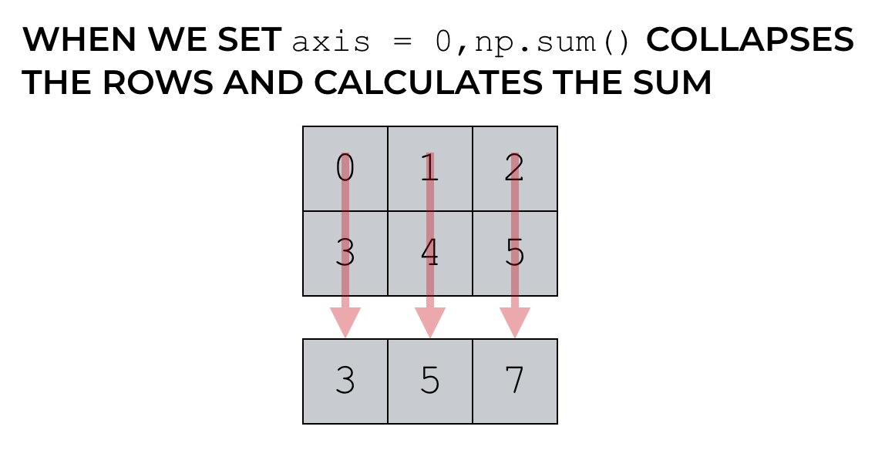
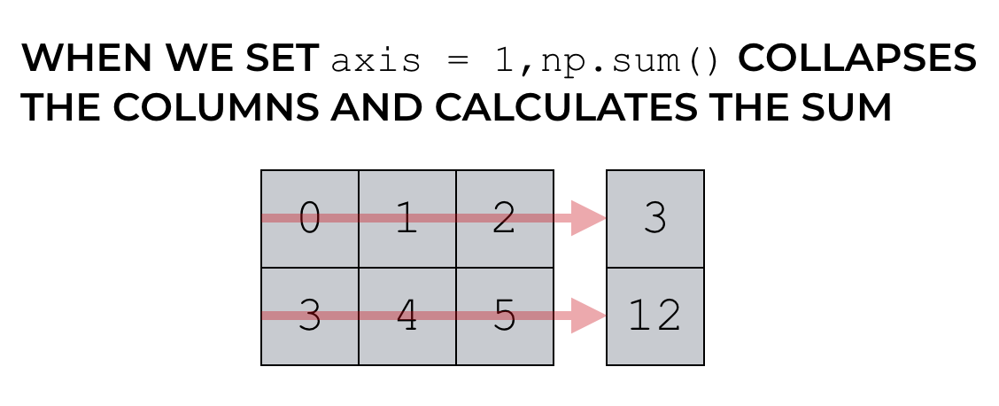

# NumPy 和 Pandas 简介

Numpy 和 Pandas 使用手册，记录基础概念和常用操作（从而在数据处理、数值计算原型开发中替代list）。  

[NumPy 官方文档](https://www.numpy.org.cn/user/)  
[Pandas 官方文档](https://www.pypandas.cn/docs/)

---------------------------------------------------------------------------------

## NumPy

NumPy包的核心是 ndarray 对象。它封装了python原生的同数据类型的 n 维数组，采用 c 语言实现后封装。

NumPy数组 和 原生Python Array（数组）之间有几个重要的区别：
+ NumPy 数组在创建时具有固定的大小，更改ndarray的大小将创建一个新数组并删除原来的数组;  
+ NumPy 数组中的元素都需要具有相同的数据类型，因此在内存中的大小相同。   
  (例外情况：Python的原生数组里包含了NumPy的对象的时候。)

---------------------------------------------------------------------------------

### 基本介绍

NumPy的主要对象是同构多维数组:  
+ ndarray.ndim  - 数组的轴（axis or rank, 维度）的个数。
+ ndarray.shape - 数组的维度。对于有 n 行和 m 列的矩阵，shape 将是 (n,m)，ndim 将是2。
+ ndarray.size  - 数组元素的总数（等于 shape 的元素的乘积）。
+ ndarray.dtype - 一个描述数组中元素类型的对象。
+ ndarray.itemsize - 数组中每个元素的字节大小（等于 ndarray.dtype.itemsize）。
+ ndarray.data  - 该缓冲区包含数组的实际元素。

---------------------------------------------------------------------------------

### np.array基本属性及创建方式

```python
>>> import numpy as np
>>> a = np.arange(15).reshape(3, 5)
>>> a
array([[ 0,  1,  2,  3,  4],
       [ 5,  6,  7,  8,  9],
       [10, 11, 12, 13, 14]])
>>> a.shape
(3, 5)
>>> a.ndim
2
>>> a.dtype.name
'int64'
>>> a.itemsize
8
>>> a.size
15
>>> type(a)
<type 'numpy.ndarray'>
>>> b = np.array([1, 2, 3])
>>> b
array([1, 2, 3])
>>> b.shape
(3,)
>>> b.reshape(3, 1)
array([[1],
       [2],
       [3]])
>>> c = np.array([(1.2, 2.3), (3.4, 5.6)])
>>> c
array([[1.2, 2.3],
       [3.4, 5.6]])
>>> c.shape
(2, 2)
```

NumPy数组的几种特殊创建方式：zeros创建一个由0组成的数组；函数 ones创建一个完整的数组；  
函数empty 创建一个数组，其初始内容是随机的。  
此外，range函数按步长创建并返回数字类型的数组（而非列表）；linspace函数按元素数量创建数据数组。

```python
>>> np.zeros((3,4))
array([[0., 0., 0., 0.],
       [0., 0., 0., 0.],
       [0., 0., 0., 0.]])
>>> np.ones((2, 3, 4), dtype=np.int16)
array([[[1, 1, 1, 1],
        [1, 1, 1, 1],
        [1, 1, 1, 1]],    
       [[1, 1, 1, 1],
        [1, 1, 1, 1],
        [1, 1, 1, 1]]], dtype=int16)
>>> np.arange(10, 30, 5)
array([10, 15, 20, 25])
>>> np.arange(0, 2, 0.3)
array([0. , 0.3, 0.6, 0.9, 1.2, 1.5, 1.8])
>>> np.linspace(0, 2, 5)
array([0. , 0.5, 1. , 1.5, 2. ])
```

---------------------------------------------------------------------------------

### np.array基本运算

NumPy数组采用 *矢量化* 技术，使数组操作更接近标准的数学符号（通常，更容易正确编码数学结构）。  

数组上的算术运算符会应用到 *元素* 级别.

```python
>>> a = np.array([20,30,40,50])
>>> b = np.arange(4)
>>> b
array([0, 1, 2, 3])
>>> c = a - b
>>> c
array([20, 29, 38, 47])
>>> b**2
array([0, 1, 4, 9], dtype=int32)
>>> np.sin(a)
array([ 0.91294525, -0.98803162,  0.74511316, -0.26237485])
>>> d = np.sin(a)
>>> d
array([ 0.91294525, -0.98803162,  0.74511316, -0.26237485])
>>> 10*d
array([ 9.12945251, -9.88031624,  7.4511316 , -2.62374854])
>>> a<35
array([ True,  True, False, False])
```

乘积运算符*在NumPy数组中按元素进行运算；矩阵乘积可以使用@运算符或dot函数或方法执行。

```python
>>> A = np.array([[1,1],[0,1]])
>>> B = np.array([[2,0],[3,4]])
>>> A * B
array([[2, 0],
       [0, 4]])
>>> A @ B
array([[5, 4],
       [3, 4]])
>>> A.dot(B)
array([[5, 4],
       [3, 4]])
```

某些操作（例如 += 和 *=）会更直接更改被操作的矩阵数组而不会创建新矩阵数组。
当使用不同类型的数组进行操作时，结果数组的类型对应于更一般或更精确的数组。

```python
>>> a = np.ones((2,3),dtype=int)
>>> b = np.random.random((2,3))
>>> a *= 3
>>> a
array([[3, 3, 3],
       [3, 3, 3]])
>>> b += a
>>> b
array([[3.75167227, 3.91048465, 3.76784294],
       [3.14670849, 3.98563566, 3.21821745]])
>>> a += b
Traceback (most recent call last):
  File "<pyshell#25>", line 1, in <module>
    a += b
numpy.core._exceptions.UFuncTypeError: Cannot cast ufunc 'add' output 
from dtype('float64') to dtype('int32') with casting rule 'same_kind'
>>> c = a + b
>>> c
array([[6.75167227, 6.91048465, 6.76784294],
       [6.14670849, 6.98563566, 6.21821745]])
```

许多一元操作，例如计算数组中所有元素的总和，都是作为ndarray类的方法实现的。
默认情况下，这些操作适用于数组，就像它是一个数字列表一样，无论其形状如何。
但是，通过指定axis 参数，您可以沿数组的指定轴应用操作。
<center>
<figure>



</figure>
</center>

```python
>>> a = np.random.random((2, 3))
>>> a
array([[0.02771408, 0.04745953, 0.26362967],
       [0.32621487, 0.34452003, 0.38167734]])
>>> a.sum()
1.3912155213101918
>>> a.min()
0.027714083215368057
>>> a.max()
0.3816773401996695

>>> b = np.arange(12).reshape(3, 4)
>>> b
array([[ 0,  1,  2,  3],
       [ 4,  5,  6,  7],
       [ 8,  9, 10, 11]])
>>> b.sum(axis=0)         #axis指定哪个轴（维度）被折叠，=0表示行折叠
array([12, 15, 18, 21])
>>> b.min(axis=1)         #=1表示列折叠
array([0, 4, 8])
>>> b.cumsum(axis=1)      #沿列累加
array([[ 0,  1,  3,  6],
       [ 4,  9, 15, 22],
       [ 8, 17, 27, 38]], dtype=int32)
```

---------------------------------------------------------------------------------

### 通函数 ufunc

NumPy提供熟悉的数学函数，例如sin，cos和exp。在NumPy中，这些被称为“通函数”（ufunc）。
在NumPy中，这些函数在数组上按元素进行运算，产生一个数组作为输出。

---------------------------------------------------------------------------------

### 索引、切片、迭代

一维的数组可以进行索引、切片和迭代操作的，就像 python 列表一样。
多维的数组每个轴可以有一个索引，这些索引以逗号​​分隔的元组给出。

```python
>>> def f(x,y):
...     return 10*x+y
...
>>> b = np.fromfunction(f,(5,4),dtype=int)
>>> b
array([[ 0,  1,  2,  3],
       [10, 11, 12, 13],
       [20, 21, 22, 23],
       [30, 31, 32, 33],
       [40, 41, 42, 43]])

>>> b[2,3]                          # 索引
23
>>> b[0:5, 1]                       # each row in the second column of b
array([ 1, 11, 21, 31, 41])
>>> b[ : ,1]                        # equivalent to the previous example
array([ 1, 11, 21, 31, 41])
>>> b[1:3, : ]                      # each column in the second and third row of b
array([[10, 11, 12, 13],
       [20, 21, 22, 23]])
>>> b[-1]                           # the last row. Equivalent to b[-1,:]
array([40, 41, 42, 43])

>>> for row in b:                   # 对多维数组进行 迭代, 是相对于第一个轴完成的
...     print(row)
...
[0 1 2 3]
[10 11 12 13]
[20 21 22 23]
[30 31 32 33]
[40 41 42 43]
>>> for element in b.flat:          # 使用flat属性，对数组中的每个元素执行操作
...     print(element)
...
0
1
2
3
10
11
12
13
20
21
22
23
30
31
32
33
40
41
42
43

```

---------------------------------------------------------------------------------

### 改变数组形状

可以使用各种命令更改数组的形状。

```python
>>> np.floor(10.3)         # floor()返回不大于参数的最大整数
10.0
>>> a = np.floor(10*np.random.random((3,4)))
>>> a
array([[5., 9., 6., 3.],
       [4., 6., 3., 4.],
       [8., 9., 8., 5.]])
>>> a.ravel()              # revel()返回扁平数组，原数组不变
array([5., 9., 6., 3., 4., 6., 3., 4., 8., 9., 8., 5.])
>>> a.reshape(6,2)         # reshape()返回修改后的数组，原数组不变
array([[5., 9.],
       [6., 3.],
       [4., 6.],
       [3., 4.],
       [8., 9.],
       [8., 5.]])
>>> a.reshape((3,-1))      # size 指定为-1，则会自动计算其他维度的 size 大小
array([[5., 9., 6., 3.],
       [4., 6., 3., 4.],
       [8., 9., 8., 5.]])
>>> a.T                    # 返回转置后的数组（矩阵），原数组不变
array([[5., 4., 8.],
       [9., 6., 9.],
       [6., 3., 8.],
       [3., 4., 5.]])
>>> a.shape
(3, 4)
>>> a.T.shape
(4, 3)
>>> a.ravel().shape
(12,)

>>> a.resize((2,6))        # resize()直接修改原数组
>>> a
array([[5., 9., 6., 3., 4., 6.],
       [3., 4., 8., 9., 8., 5.]])
```

---------------------------------------------------------------------------------

### 数组堆叠

几个数组可以沿不同的轴堆叠在一起。

```python
>>> a = np.floor(10*np.random.random((2,2)))
>>> a
array([[3., 9.],
       [4., 5.]])
>>> b = np.floor(10*np.random.random((2,2)))
>>> b
array([[4., 8.],
       [2., 2.]])
>>> np.vstack((a,b))       # 沿竖直轴堆叠
array([[3., 9.],
       [4., 5.],
       [4., 8.],
       [2., 2.]])
>>> np.hstack((a,b))       # 沿水平轴堆叠
array([[3., 9., 4., 8.],
       [4., 5., 2., 2.]])
```

---------------------------------------------------------------------------------

### 数组拆分

可以沿数组的轴拆分数组，指定要返回的形状相等的数组的数量，或指定要在其之后进行分割的行或列。

```python
>>> a = np.floor(10*np.random.random((2,12)))
>>> a
array([[8., 8., 4., 4., 1., 3., 0., 0., 4., 9., 9., 2.],
       [8., 9., 0., 8., 7., 2., 5., 3., 5., 9., 0., 3.]])
>>> np.hsplit(a,3)         # 沿水平轴拆分数组为3等份，返回python 列表，原数组不变
[array([[8., 8., 4., 4.],
       [8., 9., 0., 8.]]), array([[1., 3., 0., 0.],
       [7., 2., 5., 3.]]), array([[4., 9., 9., 2.],
       [5., 9., 0., 3.]])]
>>> np.hsplit(a, (3,4))    # 沿水平轴拆分第三列，数组总数为3份
[array([[8., 8., 4.],
       [8., 9., 0.]]), array([[4.],
       [8.]]), array([[1., 3., 0., 0., 4., 9., 9., 2.],
       [7., 2., 5., 3., 5., 9., 0., 3.]])]
>>> np.vsplit(a,2)         # 沿竖直轴拆分数组为2等份
[array([[8., 8., 4., 4., 1., 3., 0., 0., 4., 9., 9., 2.]]), array([[8., 9., 0., 8., 7., 2., 5., 3., 5., 9., 0., 3.]])]

>>> x = np.floor(10*np.random.random((3,3)))
>>> x
array([[2., 0., 0.],
       [9., 6., 4.],
       [3., 9., 6.]])
>>> np.array_split(x, 3, 1)# 允许指定要分割的轴(=1表示垂直轴)
[array([[2.],
       [9.],
       [3.]]), array([[0.],
       [6.],
       [9.]]), array([[0.],
       [4.],
       [6.]])]
>>> np.array_split(x, 3, 0)
[array([[2., 0., 0.]]), array([[9., 6., 4.]]), array([[3., 9., 6.]])]
>>> 
```

---------------------------------------------------------------------------------

### 拷贝和视图

当计算和操作数组时，有时会将数据复制到新数组中，有时则不会。

```python
>>> a = np.arange(12)
>>> b = a                  # 未创建新数组对象（b相当于a的引用）
>>> b is a
True
>>> a
array([ 0,  1,  2,  3,  4,  5,  6,  7,  8,  9, 10, 11])
>>> b
array([ 0,  1,  2,  3,  4,  5,  6,  7,  8,  9, 10, 11])
>>> b[2] = 3
>>> b
array([ 0,  1,  3,  3,  4,  5,  6,  7,  8,  9, 10, 11])
>>> a
array([ 0,  1,  3,  3,  4,  5,  6,  7,  8,  9, 10, 11])
>>> def f(x):
...     print(id(x))
...
>>> id(a)                  # id 是一个对象独有的标识
148293216
>>> f(a)
148293216

>>> c = a.view()           # view方法创建一个查看相同数据的新数组对象
>>> c is a
False
>>> c.base is a            # c 是 a 的一个视图
True
>>> c.flags.owndata
False
>>> c.shape = 2,6          # a 未改变
>>> a.shape
(3, 4)
>>> c[0] = 123                    
>>> a
array([ 123,  1,  3,  3,  4,  5,  6,  7,  8,  9, 10, 11])

>>> s = a[1:3]             # 切片数组会返回一个视图
>>> s
array([1, 3])
>>> a                      # a 改变
array([ 123, 234,   3,   3,   4,   5,   6,   7,   8,   9,  10,  11])

>>> d = a.copy()           # copy方法生成数组及其数据的完整副本
>>> d is a
False
>>> d.base is a
False
```

---------------------------------------------------------------------------------

### 常用功能和方法汇总

按类别排序的一些有用的NumPy函数和方法名称的列表：
+ 数组的创建（Array Creation） - arange, array, copy, empty, empty_like, eye, fromfile, fromfunction, identity, linspace, logspace, mgrid, ogrid, ones, ones_like, zeros, zeros_like
+ 转换和变换（Conversions） - ndarray.astype, atleast_1d, atleast_2d, atleast_3d, mat
+ 操纵术（Manipulations） - array_split, column_stack, concatenate, diagonal, dsplit, dstack, hsplit, hstack, ndarray.item, newaxis, ravel, repeat, reshape, resize, squeeze, swapaxes, take, transpose, vsplit, vstack
+ 询问（Questions） - all, any, nonzero, where,
+ 顺序（Ordering） - argmax, argmin, argsort, max, min, ptp, searchsorted, sort
+ 操作（Operations） - choose, compress, cumprod, cumsum, inner, ndarray.fill, imag, prod, put, putmask, real, sum
+ 基本统计（Basic Statistics） - cov, mean, std, var
+ 基本线性代数（Basic Linear Algebra） - cross, dot, outer, linalg.svd, vdot

---------------------------------------------------------------------------------

## Pandas
Pandas 是一个数据分析支持库，提供了快速、明确的数据结构，用于处理关系型、标记型数据。 

Pandas 主要的数据结构是 Series（一维数据）与 DataFrame（二维数据），适用于处理以下类型数据：
+ 与 SQL 或 Excel 表类似的，含异构列的表格数据;
+ 有序和无序（非固定频率）的时间序列数据;
+ 带行列标签的矩阵数据，包括同构或异构型数据;
+ 任意其它形式的观测、统计数据集, 数据转入 Pandas 数据结构时不必事先标记。

Pandas 所有数据结构的值都可变，但数据结构的大小并非都是可变的，比如，Series 的长度不可改变，  
但 DataFrame 里就可以插入列。Pandas 里，绝大多数方法都不改变原始的输入数据，  
而是复制数据，生成新的对象。

---------------------------------------------------------------------------------

### 生成对象

用值列表生成 Series时，Pandas 默认自动生成整数索引：

```python
>>> import numpy as np, pandas as pd
>>> s = pd.Series([1,3,5,np.nan,6,8])  # Series([data, index, dtype, name, copy, …])
>>> s
0    1.0
1    3.0
2    5.0
3    NaN
4    6.0
5    8.0
dtype: float64
>>> pd.Series(1, index=list(range(4)), dtype='float32')
0    1.0
1    1.0
2    1.0
3    1.0
dtype: float32
>>> pd.Series(np.arange(3))
0    0
1    1
2    2
dtype: int32
>>> pd.Series(np.random.random(3))
0    0.787086
1    0.439245
2    0.128807
dtype: float64
```

用date_range生成时间序列：

```python
>>> dates = pd.date_range('20210101',periods=6)          # 生成时间序列区间
>>> dates
DatetimeIndex(['2021-01-01', '2021-01-02', '2021-01-03', '2021-01-04',
               '2021-01-05', '2021-01-06'],
              dtype='datetime64[ns]', freq='D')
>>> pd.date_range(start="20200101", end="20200106")      # 指定起止时间，默认间隔day
DatetimeIndex(['2020-01-01', '2020-01-02', '2020-01-03', '2020-01-04',
               '2020-01-05', '2020-01-06'],
              dtype='datetime64[ns]', freq='D')
>>> pd.date_range(start="20200101",periods=3, freq='M')  # 指定起时间、周期数和日期频次
DatetimeIndex(['2020-01-31', '2020-02-29', '2020-03-31'], dtype='datetime64[ns]', freq='M')
>>> pd.date_range(start="20200101",periods=3, freq='3M') # 时间频次为3M
DatetimeIndex(['2020-01-31', '2020-04-30', '2020-07-31'], dtype='datetime64[ns]', freq='3M')
>>> pd.date_range(start="20200101",periods=3, freq='H')  # 时间频次为1H
DatetimeIndex(['2020-01-01 00:00:00', '2020-01-01 01:00:00',
               '2020-01-01 02:00:00'],
              dtype='datetime64[ns]', freq='H')
>>> pd.date_range(start="20200101",periods=3, freq='6H') # 时间频次为6H
DatetimeIndex(['2020-01-01 00:00:00', '2020-01-01 06:00:00',
               '2020-01-01 12:00:00'],
              dtype='datetime64[ns]', freq='6H')
```

用 Series 字典对象或含日期时间索引与标签的 NumPy 数组生成 DataFrame：

```python
>>> dates = pd.date_range('20210101',periods=6)  
>>> dates
DatetimeIndex(['2021-01-01', '2021-01-02', '2021-01-03', '2021-01-04',
               '2021-01-05', '2021-01-06'],
              dtype='datetime64[ns]', freq='D')
>>> df = pd.DataFrame(np.random.randn(6,4), index=dates, columns=list("ABCD"))
>>> df
                   A         B         C         D
2021-01-01  0.733114  0.359712 -2.144865  0.398522
2021-01-02  0.907588  0.113025  0.235091 -0.562068
2021-01-03  1.215295  0.172661  1.247884 -1.097749
2021-01-04  0.727865  1.632184 -0.525264 -0.386282
2021-01-05  0.161810 -0.520285  0.172506  0.975065
2021-01-06  0.610469 -0.737316  0.248985  1.456417

>>> df2 = pd.DataFrame({'A':1, 
                        'B':pd.Timestamp("20200101"),
                        'C':np.array([3]*4, dtype='int32'), 
                        'D':pd.Series(1, index=list(range(4)), dtype='float32'), 
                        'E': pd.Categorical(["test", "train", "test", "train"]),
                        'F': 'foo'})
>>> df2                                  # 自动对齐
   A          B  C    D      E    F
0  1 2020-01-01  3  1.0   test  foo
1  1 2020-01-01  3  1.0  train  foo
2  1 2020-01-01  3  1.0   test  foo
3  1 2020-01-01  3  1.0  train  foo
>>> df2.dtypes                           # 不同行有不同的数据类型
A             int64
B    datetime64[ns]
C             int32
D           float32
E          category
F            object
dtype: object
```

---------------------------------------------------------------------------------

### 查看数据

```python
>>> df
                   A         B         C         D
2021-01-01  0.733114  0.359712 -2.144865  0.398522
2021-01-02  0.907588  0.113025  0.235091 -0.562068
2021-01-03  1.215295  0.172661  1.247884 -1.097749
2021-01-04  0.727865  1.632184 -0.525264 -0.386282
2021-01-05  0.161810 -0.520285  0.172506  0.975065
2021-01-06  0.610469 -0.737316  0.248985  1.456417
>>> df.head(2)                                       # 查看头部2组数据
                   A         B         C         D
2021-01-01  0.733114  0.359712 -2.144865  0.398522
2021-01-02  0.907588  0.113025  0.235091 -0.562068
>>> df.tail(2)                                       # 查看尾部2组数据
                   A         B         C         D
2021-01-05  0.161810 -0.520285  0.172506  0.975065
2021-01-06  0.610469 -0.737316  0.248985  1.456417
>>> df.index                                         # 查看行索引
DatetimeIndex(['2021-01-01', '2021-01-02', '2021-01-03', '2021-01-04',
               '2021-01-05', '2021-01-06'],
              dtype='datetime64[ns]', freq='D')
>>> df.columns                                       # 查看列索引
Index(['A', 'B', 'C', 'D'], dtype='object')
>>> df.describe()                                    # 查看数据统计摘要
              A         B         C         D
count  6.000000  6.000000  6.000000  6.000000
mean   0.726024  0.169997 -0.127610  0.130651
std    0.347591  0.833899  1.138673  0.979642
min    0.161810 -0.737316 -2.144865 -1.097749
25%    0.639818 -0.361957 -0.350822 -0.518122
50%    0.730489  0.142843  0.203799  0.006120
75%    0.863970  0.312949  0.245511  0.830929
max    1.215295  1.632184  1.247884  1.456417

>>> df.to_numpy()                                    # 转numpy数组，原数据帧不变
array([[ 0.73311351,  0.35971156, -2.14486497,  0.39852166],
       [ 0.90758833,  0.11302518,  0.23509114, -0.56206825],
       [ 1.21529513,  0.17266088,  1.24788445, -1.09774938],
       [ 0.7278649 ,  1.63218411, -0.52526412, -0.38628167],
       [ 0.16180972, -0.52028466,  0.17250614,  0.97506493],
       [ 0.61046947, -0.73731573,  0.24898482,  1.45641713]])
>>> df.T                                             # 转置数组，原数据帧不变
   2021-01-01  2021-01-02  2021-01-03  2021-01-04  2021-01-05  2021-01-06
A    0.733114    0.907588    1.215295    0.727865    0.161810    0.610469
B    0.359712    0.113025    0.172661    1.632184   -0.520285   -0.737316
C   -2.144865    0.235091    1.247884   -0.525264    0.172506    0.248985
D    0.398522   -0.562068   -1.097749   -0.386282    0.975065    1.456417
>>> df.sort_index(axis=1, ascending=False)           # 按轴(索引)逆序排序，原数据帧不变
                   D         C         B         A
2021-01-01  0.398522 -2.144865  0.359712  0.733114
2021-01-02 -0.562068  0.235091  0.113025  0.907588
2021-01-03 -1.097749  1.247884  0.172661  1.215295
2021-01-04 -0.386282 -0.525264  1.632184  0.727865
2021-01-05  0.975065  0.172506 -0.520285  0.161810
2021-01-06  1.456417  0.248985 -0.737316  0.610469
>>> df.sort_values(by="B")                           # 按列值排序，原数据帧不变
                   A         B         C         D
2021-01-06  0.610469 -0.737316  0.248985  1.456417
2021-01-05  0.161810 -0.520285  0.172506  0.975065
2021-01-02  0.907588  0.113025  0.235091 -0.562068
2021-01-03  1.215295  0.172661  1.247884 -1.097749
2021-01-01  0.733114  0.359712 -2.144865  0.398522
2021-01-04  0.727865  1.632184 -0.525264 -0.386282       
```

---------------------------------------------------------------------------------

### 选择
对于生产代码，我们还是推荐优化过的 Pandas 数据访问方法：.at、.iat、.loc 和 .iloc。

数据帧行、列单选以及切片：
```python
>>> df
                   A         B         C         D
2021-01-01  0.733114  0.359712 -2.144865  0.398522
2021-01-02  0.907588  0.113025  0.235091 -0.562068
2021-01-03  1.215295  0.172661  1.247884 -1.097749
2021-01-04  0.727865  1.632184 -0.525264 -0.386282
2021-01-05  0.161810 -0.520285  0.172506  0.975065
2021-01-06  0.610469 -0.737316  0.248985  1.456417

>>> df['A']                                  # 选择单列，产生 Series，与 df.A 等效
2021-01-01    0.733114
2021-01-02    0.907588
2021-01-03    1.215295
2021-01-04    0.727865
2021-01-05    0.161810
2021-01-06    0.610469
Freq: D, Name: A, dtype: float64
>>> df.A                                     # df.A 取单列
2021-01-01    0.733114
2021-01-02    0.907588
2021-01-03    1.215295
2021-01-04    0.727865
2021-01-05    0.161810
2021-01-06    0.610469
Freq: D, Name: A, dtype: float64

>>> df[0:2]                                  # 按行索引切片，与按索引切片等效
                   A         B         C         D
2021-01-01  0.733114  0.359712 -2.144865  0.398522
2021-01-02  0.907588  0.113025  0.235091 -0.562068
>>> df["20210101":"20210102"]                # 按索引切片
                   A         B         C         D
2021-01-01  0.733114  0.359712 -2.144865  0.398522
2021-01-02  0.907588  0.113025  0.235091 -0.562068
```

按标签选择：
```python
>>> df.loc['20210101']                       # 按索引(标签)选择一行数据
A    0.733114
B    0.359712
C   -2.144865
D    0.398522
Name: 2021-01-01 00:00:00, dtype: float64
>>> df.loc['20210102':'20210104', ['A', 'B']] # 用标签切片，包含行与列结束点
                   A         B
2021-01-02  0.907588  0.113025
2021-01-03  1.215295  0.172661
2021-01-04  0.727865  1.632184
>>> df.loc[:,['A', 'B']]                      # 用标签选择多列数据
                   A         B
2021-01-01  0.733114  0.359712
2021-01-02  0.907588  0.113025
2021-01-03  1.215295  0.172661
2021-01-04  0.727865  1.632184
2021-01-05  0.161810 -0.520285
2021-01-06  0.610469 -0.737316
>>> df.loc["20210101",['A', 'B']]            # 返回对象降维
A    0.733114
B    0.359712
Name: 2021-01-01 00:00:00, dtype: float64
>>> df.loc["20210101", 'A']                  # 提取标量值
0.7331135120665707
>>> df.at["20210101", 'A']                   # 快速访问标量     
0.7331135120665707
>>> 
```

按位置索引：
```python
>>> df.iloc[3]                               # 用整数位置选择
A    0.727865
B    1.632184
C   -0.525264
D   -0.386282
Name: 2021-01-04 00:00:00, dtype: float64
>>> df.iloc[3:5, 0:2]                        # 类似 NumPy / Python，用整数切片
                   A         B
2021-01-04  0.727865  1.632184
2021-01-05  0.161810 -0.520285
>>> df.iloc[[1,2,5], [0,2]]                  # 类似 NumPy / Python，用整数列表切片
                   A         C
2021-01-02  0.907588  0.235091
2021-01-03  1.215295  1.247884
2021-01-06  0.610469  0.248985
>>> df.iloc[1:3, :]                          # 显式整行切片
                   A         B         C         D
2021-01-02  0.907588  0.113025  0.235091 -0.562068
2021-01-03  1.215295  0.172661  1.247884 -1.097749
>>> df.iloc[:, 1:3]                          # 显式整列切片
                   B         C
2021-01-01  0.359712 -2.144865
2021-01-02  0.113025  0.235091
2021-01-03  0.172661  1.247884
2021-01-04  1.632184 -0.525264
2021-01-05 -0.520285  0.172506
2021-01-06 -0.737316  0.248985
>>> df.iloc[1,1]                             # 显式提取值
0.11302518055217689
>>> df.iat[1,1]                              # 快速访问标量
0.11302518055217689
```

布尔索引选择：
```python
>>> df[df.B > 0]                             # 用单列的值选择数据
                   A         B         C         D
2021-01-01  0.733114  0.359712 -2.144865  0.398522
2021-01-02  0.907588  0.113025  0.235091 -0.562068
2021-01-03  1.215295  0.172661  1.247884 -1.097749
2021-01-04  0.727865  1.632184 -0.525264 -0.386282
>>> df[df > 0]                               # 选择 DataFrame 里满足条件的值，自动对齐
                   A         B         C         D
2021-01-01  0.733114  0.359712       NaN  0.398522
2021-01-02  0.907588  0.113025  0.235091       NaN
2021-01-03  1.215295  0.172661  1.247884       NaN
2021-01-04  0.727865  1.632184       NaN       NaN
2021-01-05  0.161810       NaN  0.172506  0.975065
2021-01-06  0.610469       NaN  0.248985  1.456417
>>> df3 = df.copy()                          # 拷贝副本
>>> df3['E'] = ['one', 'one', 'two', 'three', 'four', 'three']
>>> df3
                   A         B         C         D      E
2021-01-01  0.733114  0.359712 -2.144865  0.398522    one
2021-01-02  0.907588  0.113025  0.235091 -0.562068    one
2021-01-03  1.215295  0.172661  1.247884 -1.097749    two
2021-01-04  0.727865  1.632184 -0.525264 -0.386282  three
2021-01-05  0.161810 -0.520285  0.172506  0.975065   four
2021-01-06  0.610469 -0.737316  0.248985  1.456417  three
>>> df3[df3.E.isin(['two', 'four'])]         # 用 isin() 筛选
                   A         B         C         D     E
2021-01-03  1.215295  0.172661  1.247884 -1.097749   two
2021-01-05  0.161810 -0.520285  0.172506  0.975065  four
>>> 
```

---------------------------------------------------------------------------------

### 赋值

```python
>>> df
                   A         B         C         D
2021-01-01  0.733114  0.359712 -2.144865  0.398522
2021-01-02  0.907588  0.113025  0.235091 -0.562068
2021-01-03  1.215295  0.172661  1.247884 -1.097749
2021-01-04  0.727865  1.632184 -0.525264 -0.386282
2021-01-05  0.161810 -0.520285  0.172506  0.975065
2021-01-06  0.610469 -0.737316  0.248985  1.456417

>>> s1 = pd.Series([1, 2, 3, 4, 5, 6], index=pd.date_range('20210102', periods=6))
>>> s1
2021-01-02    1
2021-01-03    2
2021-01-04    3
2021-01-05    4
2021-01-06    5
2021-01-07    6
Freq: D, dtype: int64
>>> df["F"] = s1                             # 用索引自动对齐新增列的数据
>>> df
                   A         B         C         D    F
2021-01-01  0.733114  0.359712 -2.144865  0.398522  NaN
2021-01-02  0.907588  0.113025  0.235091 -0.562068  1.0
2021-01-03  1.215295  0.172661  1.247884 -1.097749  2.0
2021-01-04  0.727865  1.632184 -0.525264 -0.386282  3.0
2021-01-05  0.161810 -0.520285  0.172506  0.975065  4.0
2021-01-06  0.610469 -0.737316  0.248985  1.456417  5.0
>>> df.at['20210101', 'F'] = 0               # 按标签赋值
>>> df
                   A         B         C         D    F
2021-01-01  0.733114  0.359712 -2.144865  0.398522  0.0
2021-01-02  0.907588  0.113025  0.235091 -0.562068  1.0
2021-01-03  1.215295  0.172661  1.247884 -1.097749  2.0
2021-01-04  0.727865  1.632184 -0.525264 -0.386282  3.0
2021-01-05  0.161810 -0.520285  0.172506  0.975065  4.0
2021-01-06  0.610469 -0.737316  0.248985  1.456417  5.0
>>> df.iat[0,1] = 6                          # 按位置赋值
>>> df
                   A         B         C         D    F
2021-01-01  0.733114  6.000000 -2.144865  0.398522  0.0
2021-01-02  0.907588  0.113025  0.235091 -0.562068  1.0
2021-01-03  1.215295  0.172661  1.247884 -1.097749  2.0
2021-01-04  0.727865  1.632184 -0.525264 -0.386282  3.0
2021-01-05  0.161810 -0.520285  0.172506  0.975065  4.0
2021-01-06  0.610469 -0.737316  0.248985  1.456417  5.0
>>> df.loc[:, "D"] = np.array([5]*len(df))   # 按 NumPy 数组赋值
>>> df
                   A         B         C  D    F
2021-01-01  0.733114  6.000000 -2.144865  5  0.0
2021-01-02  0.907588  0.113025  0.235091  5  1.0
2021-01-03  1.215295  0.172661  1.247884  5  2.0
2021-01-04  0.727865  1.632184 -0.525264  5  3.0
2021-01-05  0.161810 -0.520285  0.172506  5  4.0
2021-01-06  0.610469 -0.737316  0.248985  5  5.0

>>> df4 = df.copy()
>>> df4[df4 > 0] = -df4                      # 用 where 条件赋值
>>> df4
                   A         B         C  D    F
2021-01-01 -0.733114 -6.000000 -2.144865 -5  0.0
2021-01-02 -0.907588 -0.113025 -0.235091 -5 -1.0
2021-01-03 -1.215295 -0.172661 -1.247884 -5 -2.0
2021-01-04 -0.727865 -1.632184 -0.525264 -5 -3.0
2021-01-05 -0.161810 -0.520285 -0.172506 -5 -4.0
2021-01-06 -0.610469 -0.737316 -0.248985 -5 -5.0
```

---------------------------------------------------------------------------------

### 缺失值

Pandas 主要用 np.nan 表示缺失数据。 计算时，默认不包含空值。 

重建索引（reindex）可以更改、添加、删除指定轴的索引，并返回数据副本，即不更改原数据。
```python
>>> df
                   A         B         C  D    F
2021-01-01  0.733114  6.000000 -2.144865  5  0.0
2021-01-02  0.907588  0.113025  0.235091  5  1.0
2021-01-03  1.215295  0.172661  1.247884  5  2.0
2021-01-04  0.727865  1.632184 -0.525264  5  3.0
2021-01-05  0.161810 -0.520285  0.172506  5  4.0
2021-01-06  0.610469 -0.737316  0.248985  5  5.0
>>> df5 = df.reindex(index=(df.index)[0:4], columns=list(df.columns)+['E'])
>>> df5
                   A         B         C  D    F   E
2021-01-01  0.733114  6.000000 -2.144865  5  0.0 NaN
2021-01-02  0.907588  0.113025  0.235091  5  1.0 NaN
2021-01-03  1.215295  0.172661  1.247884  5  2.0 NaN
2021-01-04  0.727865  1.632184 -0.525264  5  3.0 NaN
>>> df5.iloc[0:1, 5] = 1                     
>>> df5
                   A         B         C  D    F    E
2021-01-01  0.733114  6.000000 -2.144865  5  0.0  1.0
2021-01-02  0.907588  0.113025  0.235091  5  1.0  NaN
2021-01-03  1.215295  0.172661  1.247884  5  2.0  NaN
2021-01-04  0.727865  1.632184 -0.525264  5  3.0  NaN
>>> df5.dropna(how='any')                    # 删除所有含缺失值的行
                   A    B         C  D    F    E
2021-01-01  0.733114  6.0 -2.144865  5  0.0  1.0
>>> df5.fillna(value=5)                      # 填充缺失值
                   A         B         C  D    F    E
2021-01-01  0.733114  6.000000 -2.144865  5  0.0  1.0
2021-01-02  0.907588  0.113025  0.235091  5  1.0  5.0
2021-01-03  1.215295  0.172661  1.247884  5  2.0  5.0
2021-01-04  0.727865  1.632184 -0.525264  5  3.0  5.0
```

---------------------------------------------------------------------------------

### 运算

一般情况下，运算时排除缺失值。
```python
>>> df
                   A         B         C  D    F
2021-01-01  0.733114  6.000000 -2.144865  5  0.0
2021-01-02  0.907588  0.113025  0.235091  5  1.0
2021-01-03  1.215295  0.172661  1.247884  5  2.0
2021-01-04  0.727865  1.632184 -0.525264  5  3.0
2021-01-05  0.161810 -0.520285  0.172506  5  4.0
2021-01-06  0.610469 -0.737316  0.248985  5  5.0
>>> df.mean()                                # 描述性统计
A    0.726024
B    1.110045
C   -0.127610
D    5.000000
F    2.500000
dtype: float64
>>> df.mean(1)                               # 在另一个轴(即，行)上执行同样的操作
2021-01-01    1.917650
2021-01-02    1.451141
2021-01-03    1.927168
2021-01-04    1.966957
2021-01-05    1.762806
2021-01-06    2.024428
Freq: D, dtype: float64
>>> df.apply(lambda x: x.max()-x.min())      # Apply 函数加载lambda 函数处理数据
A    1.053485
B    6.737316
C    3.392749
D    0.000000
F    5.000000
dtype: float64
```

---------------------------------------------------------------------------------

### 合并、分组、重塑

Pandas 提供了多种将 Series、DataFrame 对象组合在一起的功能，用索引与关联代数功能的多种设置逻辑，  
可执行连接（join）与合并（merge）操作。

```python 
>>> df = pd.DataFrame(np.random.randn(4,4))
>>> df
          0         1         2         3
0 -0.410644 -1.073073 -0.478992 -0.492174
1  0.804735  1.133463 -0.361955 -0.562920
2  1.360805 -0.678951  0.406934  0.763535
3  0.151346  0.475908 -1.246835  0.151668
>>> pieces = [df[:1], df[1:3], df[3:]]
>>> pd.concat(pieces)                        # concat() 连接 Pandas 对象
          0         1         2         3
0 -0.410644 -1.073073 -0.478992 -0.492174
1  0.804735  1.133463 -0.361955 -0.562920
2  1.360805 -0.678951  0.406934  0.763535
3  0.151346  0.475908 -1.246835  0.151668

>>> df.append(pieces[0], ignore_index=True)  # append() 追加 Pandas 对象
          0         1         2         3
0 -0.410644 -1.073073 -0.478992 -0.492174
1  0.804735  1.133463 -0.361955 -0.562920
2  1.360805 -0.678951  0.406934  0.763535
3  0.151346  0.475908 -1.246835  0.151668
4 -0.410644 -1.073073 -0.478992 -0.492174

>>> df["label"] = pd.Series(['A', 'B', 'A', 'B'])
>>> df.loc[2:, 'label'] = ['A','B']
>>> df
          0         1         2         3 label
0 -0.410644 -1.073073 -0.478992 -0.492174     A
1  0.804735  1.133463 -0.361955 -0.562920     B
2  1.360805 -0.678951  0.406934  0.763535     A
3  0.151346  0.475908 -1.246835  0.151668     B
>>> df.groupby('label').sum()                # groupby() 分组 Pandas 对象后求和
              0         1         2         3
label                                        
A      0.950161 -1.752024 -0.072057  0.271361
B      0.956081  1.609371 -1.608790 -0.411251
```

---------------------------------------------------------------------------------

### 输入输出

```python
>>> df.to_csv('foo.csv')                     # 写入 CSV 文件
>>> pd.read_csv('foo.csv')                   # 读取 CSV 文件
   Unnamed: 0         0         1         2         3 label
0           0 -0.410644 -1.073073 -0.478992 -0.492174     A
1           1  0.804735  1.133463 -0.361955 -0.562920     B
2           2  1.360805 -0.678951  0.406934  0.763535     A
3           3  0.151346  0.475908 -1.246835  0.151668     B
```

---------------------------------------------------------------------------------

### 数据可视化

```python
>>> ts = pd.Series(np.random.randn(1000),index=pd.date_range('1/1/2000', periods=1000))
>>> ts = ts.cumsum()
>>> ts.plot()                                # Series 的可视化

>>> df = pd.DataFrame(np.random.randn(1000, 4), index=ts.index,columns=['A', 'B', 'C', 'D'])
>>> df = df.cumsum()
>>> df.plot()                                # DataFrame 带标签的可视化
```

---------------------------------------------------------------------------------

